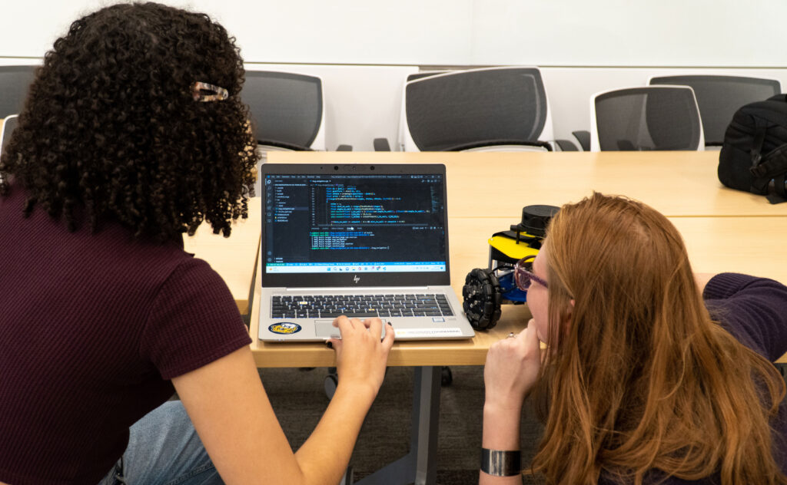

<figure>

<figcaption>

Students in ROB 102 work on coding their Mbot, the three-wheeled robot that ROB 102 uses to teach AI and programming.

</figcaption>

</figure>

Jana Pavlasek and Professor Chad Jenkins have been awarded the Claudia Joan Alexander Trailblazer Award for their work as the ROB 102 team. This award, part of the [Women in Science and Engineering's Willie Hobbs Moore Awards](https://wise.umich.edu/?page_id=63), is given to those who have developed an innovation, intervention, or program that supports equity in STEM.

Pavlasek, a Robotics PhD student, and Jenkins developed ROB 102, Introduction to AI and Programming, a new freshman-level introductory programming course as part of the new Robotics Undergraduate Program at the University of Michigan. The course is intended to act as a core course for incoming Robotics majors, as well as serve freshman CoE students interested in robotics. The course uses robotic platforms in a novel approach to teaching introductory programming, with a commitment to remaining accessible and approachable to students from all backgrounds.

<!--more-->

One of the core aims of the course is to support and empower students who come into the class with no prior programming experience, while challenging and inspiring students with prior exposure to computer science concepts. To support an inclusive and individualized approach to teaching early programming, the instructors designed the course in flipped-classroom format. This enables them to spend individual time with students to identify any challenges early, promoting a relationship-first approach to teaching.

https://www.youtube.com/watch?v=jZ0U339ewKo

In addition, the pilot offering of Robotics 102 helped introduce the "Distributed Teaching Collaborative" format with students at Berea College in Kentucky. Collaborative distributed classrooms enable instructors from different institutions, including Historically Black Colleges and Universities (HBCUs) and Minority Serving Institutions (MSIs), to benefit from open-source resources available for new course development at R1 institutions. This collaboration will provide students from HBCUs and MSIs with access to cutting-edge robotics education and help to promote equity in STEM fields.

Pavlasek and Jenkins' commitment to creating opportunity in AI and Robotics continues to extend beyond the University of Michigan. In Fall 2023, Robotics 102 will be offered in a collaborative distributed format with more HBCUs and MSIs, including Morehouse and Howard. This initiative will help to provide equitable opportunities for students from diverse backgrounds to learn and grow in the field of robotics.

Jana Pavlasek and Chad Jenkins' work in creating an innovative, inclusive, and equitable robotics education program has earned them the Claudia Joan Alexander Trailblazer Award. Their dedication to providing opportunities for students from all backgrounds to learn and grow in the field of robotics is inspiring and an example of [Michigan Robotics values](https://2024.robotics.umich.edu/about/values/ "Values").
