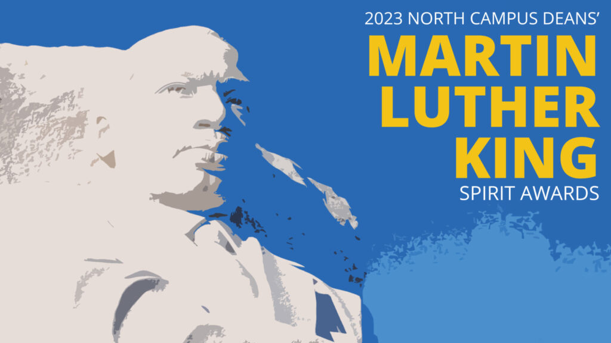
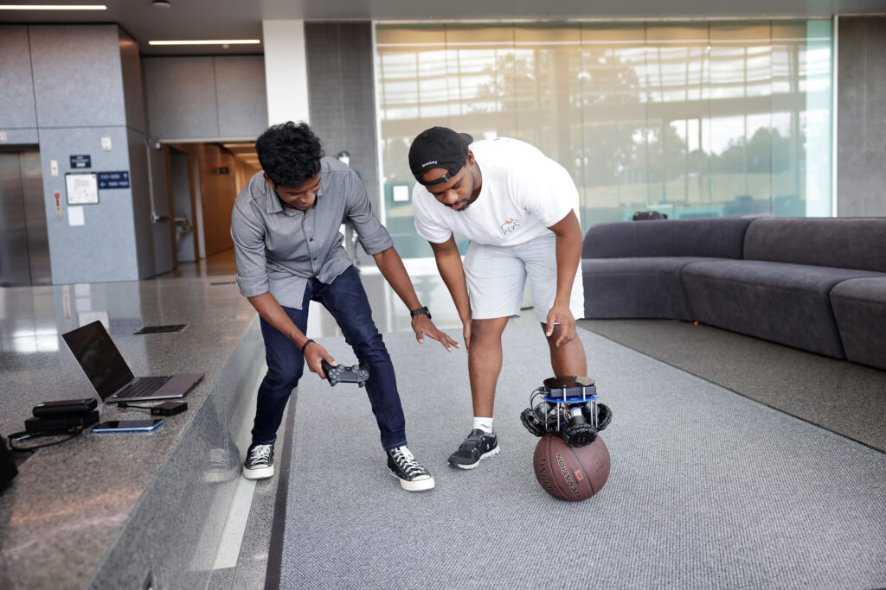

Honoring efforts that exemplify the leadership of Dr. Martin Luther King, Jr., the North Campus Deans presented Professors Jessy Grizzle and Leia Stirling and PhD student Yves Nazon with MLK Spirit Awards.

The [North Campus Deans' MLK Spirit Awards](https://artsengine.engin.umich.edu/mlk-spirit-awards/) recognizes students, faculty, and staff for "their commitment to social justice, diversity, equity, and inclusion, including within the context of the pandemic and our reignited sense of urgency to address root causes of social injustice." The award ceremony took place Monday, January 16, 2023.

https://twitter.com/LeiaStirling/status/1615178999663136768

Grizzle's nomination centered on his work in expanding access to engineering curriculum. Grizzle led the creation of [ROB 101](https://robotics.umich.edu/news/2020/now-available-robotics-101-online/ "Now available: Robotics 101 online"), Computational Linear Algebra, making it inclusive from the ground up and added entirely new avenues for dissemination of materials.

Working with Professors Jenkins and Ghaffari at U-M, and Professor Joseph at Morehouse College, the course featured:

- 20 percent pilot class participation remotely from Morehouse and Spelman colleges

- Julia, a browser-based language deliverable through Canvas, to mitigate any differences in access to powerful home computers

- Publishing of materials online on GitHub and YouTube to open source the curriculum

For these efforts, Grizzle and team earned a Provost’s Teaching Innovation Prize in 2021. Since then, the course has been adapted to be taught at the School at Marygrove, a Detroit high school, in partnership with the School of Education. The Marygrove students culminated their study with an in-person visit to several Robotics labs here on campus this past summer, hosted by Grizzle and his graduate students.

Stirling's nomination was spurred by her work as the chair for diversity, equity, and inclusion of the Industrial Operations Engineering department. In this role, Stirling worked on structural change, educational change, and cultural change. This included creating a baseline of understanding through faculty surveying and work towards a climate survey, working with faculty to bring DEI into coursework through case studies, and launching a community dialog series to hear and engage with diverse viewpoints, ideas, and experiences to understand differing perspectives.

Nazon's nomination focused on connecting with students that may have never considered robotics or graduate study, especially at U-M. Through his own initiative, Nazon planned a multi-campus speaking tour that included stops at Maryland, North Carolina, and California. Nazon presented his graduate robotics experience, engaged one-on-one, and helped mentor and advise those considering U-M.

<figure>

<figcaption>Senthur Ayyappan and Yves Nazon work on a robot design in the atrium at the Ford Robotics Building in summer of 2022. The robot they designed is for use in ROB 311, How to Build Robots and Make Them Move, one of the new undergraduate courses. It is designed to balance on top of a basketball and then move when commanded by remote controls. Photo: Brenda Ahearn.</figcaption>
</figure>

In addition, as a graduate student instructor, Nazon helped develop Robotics 311, a new undergraduate course where students learn "How to Build Robots and Make Them Move." Nazon helped create the novel robot that balances on top of and uses a basketball to roll around, like a Star Wars-inspired droid, making the curriculum both accessible and enjoyable for the students.

Robotics is proud of these standouts working to better the community through positive acts.
