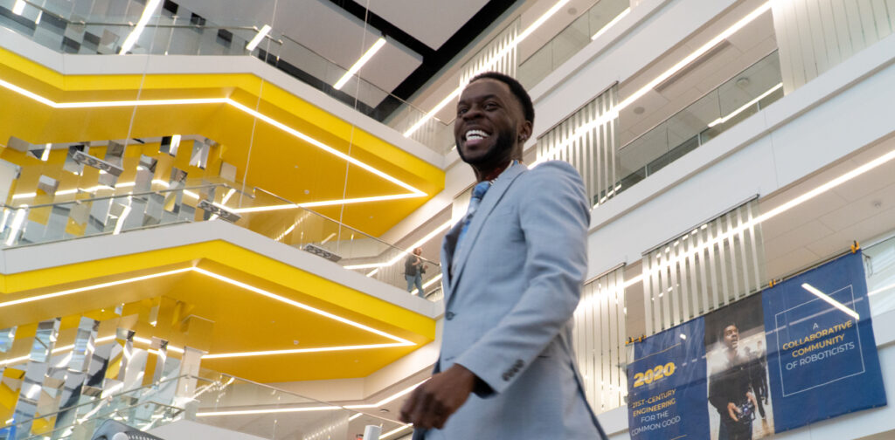

<figure>

<figcaption>

Prince Kuevor, winner of the Kabamba Award, pictured before presenting a PhD defense in January, 2023.

</figcaption>

</figure>

The exceptional achievements of this year's award-winning students in academia and leadership have brought pride to the new Robotics Department. These students have displayed a remarkable commitment to their education, research, and community. We extend our congratulations to the recipients:

<!--more-->

**Alexander Bowler**  
_Tau Beta Pi First Year Student Awards_  
This recognition highlights Alexander's exceptional achievements as a first-year student, positioning Alexander among the best and brightest of his peers.

**Jacob Jancek**  
_Distinguished Leadership Award_  
This honor is conferred upon students who have demonstrated outstanding leadership and service to the College, University, and community

**Prince Kuevor**  
_Professor Pierre T. Kabamba Award_  
This accolade recognizes Prince's excellence in aerospace engineering or control systems as a senior graduate student, honoring the late Professor Pierre T. Kabamba's dedication to education and research in the field.

**Andrea Sipos**  
_Marian Sarah Parker Prize & Richard F. and Eleanor A. Towner Prize for Distinguished Academic Achievement_  
The Marian Sarah Parker Prize is presented to an outstanding female graduate student who has demonstrated academic excellence, leadership qualities, and outstanding contributions to the University. In addition, the Richard F. and Eleanor A. Towner Prize for Distinguished Academic Achievement recognizes an active participation in research, leadership, and exceptional academic performance.

**Samantha Staudinger**   
_Arthur B. Singleton Prize & Tau Beta Pi First Year Student Awards_  
The prestigious Arthur B. Singleton Prize is presented to an outstanding first-year student who has demonstrated academic excellence by earning a 4.0 GPA in their first semester. The Tau Beta Pi First Year Student Awards recognizes the top first-year students.

**Joseph Taylor**  
_Distinguished Academic Achievement Undergraduate Award_  
The Distinguished Academic Achievement Undergraduate Award recognizes outstanding achievements in an academic program, exemplary character, leadership in class and activities, and potential for success in future endeavors.

We extend our warmest congratulations to all the award recipients for their diligence, dedication, and outstanding accomplishments. We have no doubt that each of you will continue to make a meaningful impact and bring positive contributions to both the University and the wider community.
