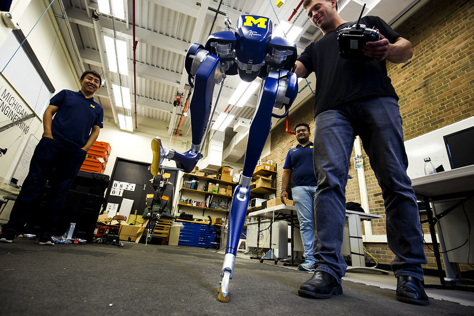
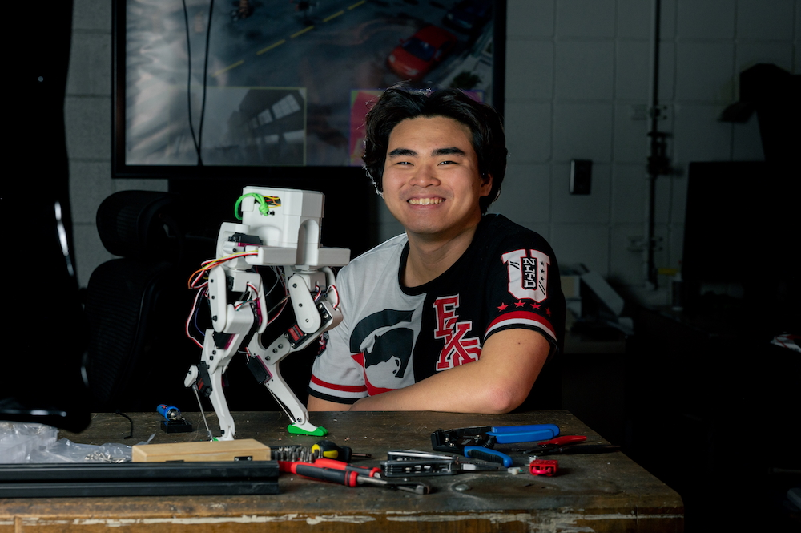
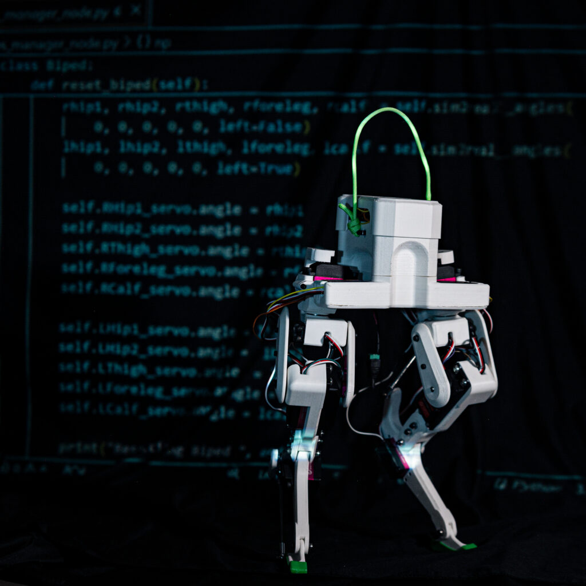

A 3D-printed bipedal robot inspired by the design of a commercial-scale robot aims to provide an open-source platform for studying and applying reinforcement learning. David Ho, a master’s student in robotics at University of Michigan, developed the one-foot-tall robot, named Legolas.

The design of Legolas is inspired by Agility Robotics’ Cassie robot. This includes inverted legs, like the namesake Cassowary bird.

<figure>

<figcaption>Researchers unbox and test Cassie, Prof. Jessy Grizzle's new robot with serial number 001, in August, 2017. Photo: Joseph Xu/Michigan Engineering, Communications & Marketing</figcaption>
</figure>

“I was particularly inspired by the structure of Cassie’s legs,” Ho said. “Agility Robotics' mathematical and physics-based solution that inadvertently mimicked natural biomechanical structures was fascinating. It’s incredible how their practical approach converged toward biomimicry.”

Ho began the project as a mechanical engineering student at Texas A&M University, and has since published the design and parts, all available from Amazon, [on GitHub](https://github.com/daviddoo02/Legolas-an-open-source-biped/tree/main).

“My vision for Legolas is to inspire younger versions of myself, showing the joys of engineering and robotics,” said Ho. “There are many areas for improvement and features to add. I hope to engage more Michigan Roboticists to make this vision a reality.”

<figure>

<figcaption>David Ho and the Legolas bipedal robot he designed and built. Photo: Wanyu Xu.</figcaption>
</figure>

For more details on the project, Ho answered a few questions:

**What specific components do you use for the construction of Legolas?**

Legolas’s main body is entirely 3D printed. For the electronics, I used:

- Raspberry Pi 4

- 40 kg Hobby Servos x 8

- 80 kg Hobby Servos x 2

- One MPU6050 IMU to measure the body’s position and orientation

I opted to exclude any batteries from Legolas, which not only saved weight but allowed for continuous testing without worrying about battery life.

**Could you describe the process you followed to design and build Legolas?**

As Legolas was my first from-scratch robotics project, I spent a lot of time experimenting. My process can be summed up as: do some stuff, evaluate what’s not working, hypothesize, and test again. Here’s a more detailed breakdown:

1. Gathered materials without purchasing if possible.

2. Built a prototype with those materials.

3. Exhaustively tested it to identify what worked and what didn’t.

4. Formed hypotheses about the failures to guide future steps.

5. Repeated the process – the faster I built and broke things, the quicker I learned.

**What challenges did you encounter during the development?**

Many! Tackling the complex kinematics of a closed-chain manipulator, and struggling with a slow, 2D numerical kinematics program built in pygame are a few. After consulting robotics books, I switched to proper transformation matrices using numpy. Soon after, I discovered a geometric simplification that required another redesign.

<figure>

<figcaption>Legolas stands in front of its code. Photo: Wanyu Xu</figcaption>
</figure>

**What are some of the key lessons you learned from this project?**

The biggest lesson I learned was: There is no perfect plan, just start doing something.

I would have wasted a lot of time and learning opportunities had I waited and waited until I knew exactly what I was going to do from start to finish. Plus things are boring when they go exactly as planned, the interesting (and good) stuff are where the plan falls apart and things break.

I also learned persistence and perseverance are going to solve all problems: Technical problems were much easier to deal with compared to the emotional doubts and pessimism I occasionally felt in the course of the project, but I got really good at digesting them bite by bite:

1. When (mood is frustrated):
    1. Try:
        1. Eat food
        
        3. If mood doesn’t improve
    
    3. Try:
        1. Talk to someone
        
        3. If mood doesn’t improve
    
    5. Try:
        1. Take a nap
        
        3. If mood doesn’t improve
    
    7. Try:
        1. Take a walk
        
        3. If mood doesn’t improve
    
    9. Get back to work

I remembered my goal everyday for a while was just to make something happen–even if it broke the robot, it was a step forward, plus something else to do the next day.

Finally, good support groups go a long way. I’m forever grateful for my research lab back then. They were all older and more experienced than me. They not only showed me the rope for robotics, but they gave me a lot of encouragement and advice when things went wrong. I used to complain to them a lot about how frustrating it was, but they all believed in me and I think that’s what kept me accountable and helped me persevere.

**Why did you choose to use ROS for Legolas?**

Initially, it was a way to practice what I was learning about ROS. Over time, I came to appreciate ROS’s modularity and flexibility.

**Do you have any other robotics projects in mind?**

Yes, I’m considering developing a hopping Kangaroo Robot!

**What inspired you to pursue a master's degree in robotics?**

I worked with an amazing professor and amazing PhD students at the Unmanned System Lab at Texas A&M. It was thanks to them that I re-learned how exciting robotics can be. All the days, nights, and weekends that I spent working on their robots and learning how to use ROS inspired great joy in me–so much so, that I decided that there’s nothing else I’d rather do with my life than making and studying robots.

**What specific aspects of the University of Michigan's robotics program drew you to apply?**

The exceptional faculty and the fact that the U-M Robotics Department is the first of its kind in the U.S. were significant factors. Additionally, my undergraduate professor, Dr. Srikanth Saripalli, spoke very highly of the department, which greatly influenced my decision.

**How do you hope to work together and collaborate with fellow students and faculty at the University of Michigan?**

I’m highly extroverted and eager to share my passion for robotics. I aim to find like-minded individuals to collaborate with and achieve goals that would be impossible to tackle alone.
