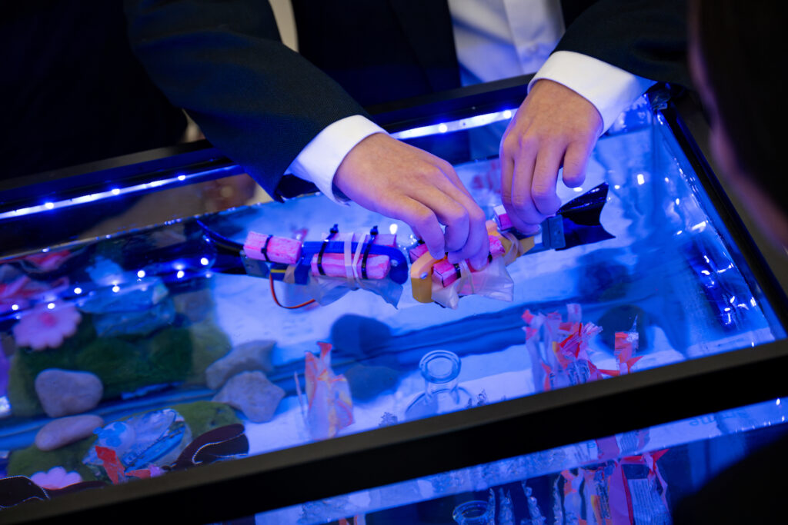
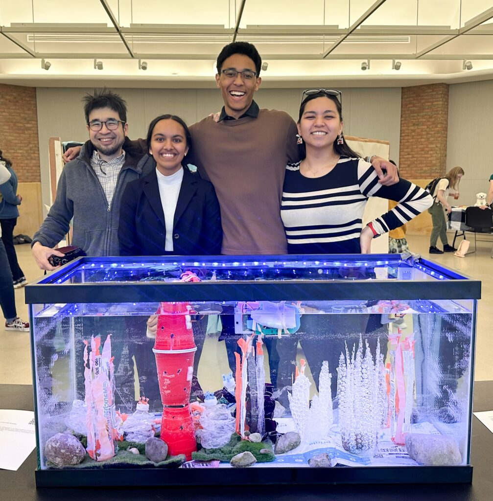

<figure>

<figcaption>A robot fish is placed in an aquarium.</figcaption>
</figure>

Three University of Michigan students engineered a robotic school of fish prototype, named "[Swarm Fish](https://sites.google.com/umich.edu/dev-blog/home)," as part of their class project in ROB 203: Robotics Mechanisms.

The project, by students Devin Jones, Krystelle Fernandez, and Yatee Balan, is just one example of the many robotics course projects that offer students rigorous hands-on work and prepare student roboticists to meet the emerging needs of society.

<!--more-->

https://youtube.com/shorts/w7hUNs7l0HM

For Swarm Fish, the team created robotic fish that swim autonomously around a tank with decorative elements made from common trash, such as discarded ramen packaging as coral. A few of the challenges the team had to overcome included waterproofing electronics, coding fish behavior, and calculating appropriate buoyancy and tail movements. In addition to the engineering tasks, the team wanted to communicate the effects of plastic pollution on aquatic life.

<figure>

<figcaption>The team in front of a successful demonstration at the Arts Engine symposium.</figcaption>
</figure>

Following the project, the students discussed what drew them to the course.

Balan said, "I wanted to have hands-on experience with creating robotics in a fun and low-stakes environment," appreciating that the class allowed them to take theoretical knowledge and turn it into any idea they wanted to pursue. Adding to this, Jones chose ROB 203 to get a broad understanding of robotics, and enjoyed seeing peers bring their diverse ideas to fruition. Fernandez was looking for a multidisciplinary course to bridge the gap between design and actual building of a robot, adding to previous knowledge from courses like ENGR 100 and ROB 204.

Their experience in ROB 203 not only equipped them with versatile skills—ranging from CAD design to coding and soldering—but also reshaped their understanding of robotics.

Balan says it broadened students' view of the field, envisioning robotics as an art form that can deliver potent societal messages. Similarly, Jones included insight into how engineers can work with those outside of engineering in cross-collaborations, incorporating thoughtful design into robotics systems to create a superior outcome.

And Fernandez reflected on employing 'people-first engineering':

"It made me think more about stakeholders not always being users, and how that can apply to robots within society. It’s a good reminder to consider the effects a design can have regardless of if they’re related to the robot’s ability to function. For example, a robot’s appearance, whether or not it interacts with humans directly, can affect people’s perception of it and can even invoke emotion."

As instructor of ROB 203, [Derrick Yeo](https://robotics.umich.edu/people/faculty/derrick-yeo/ "Derrick Yeo") mentored the team.

"The projects are pretty open ended so it can be easy to get lost without clear instructions and deadlines, but Dr. Yeo is an amazing guide and will lead you in the right direction," added Fernandez.

Dr. Yeo and Professor [Chad Jenkins](https://robotics.umich.edu/people/faculty/chad-jenkins/ "Chad Jenkins") developed ROB 203, which encompasses hands-on design, building, operations of robotic systems, and development of maker-shop skills, as a part of the new robotics undergraduate major offered at U-M. It is another example of how Michigan roboticists are pioneering teachers and learners who are defining the discipline of robotics.
