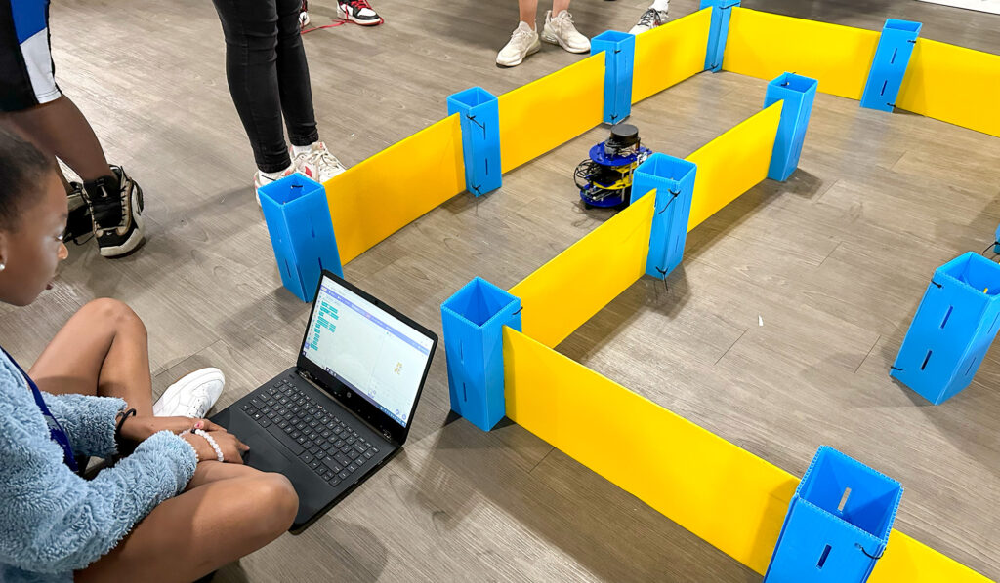
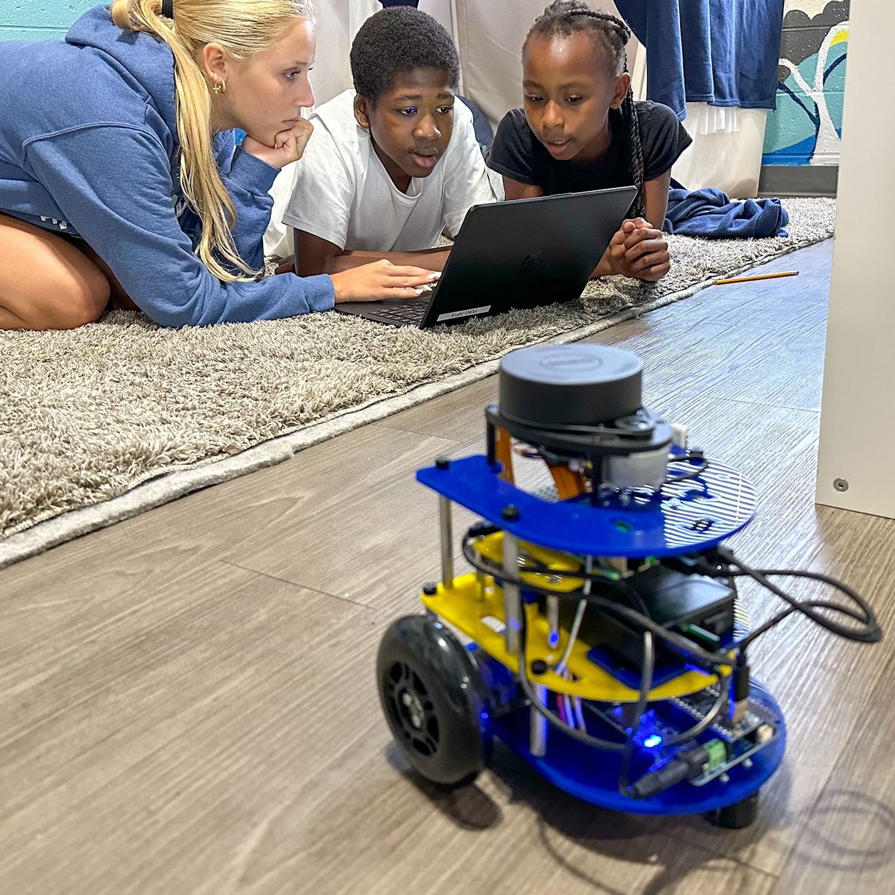
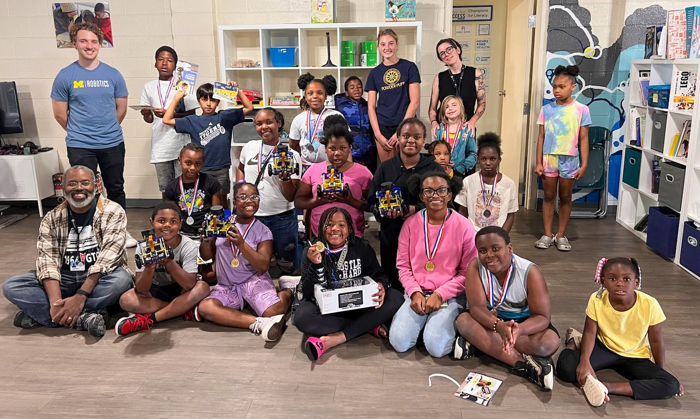

<figure>

<figcaption>A Center for Success student runs their Scratch program on an MBot to have it autonomously navigate the maze. Courtesy Brody Riopelle.</figcaption>
</figure>

Brody Riopelle (CE 2024) recently proved that [MBots](http://mbot.robotics.umich.edu/), a University of Michigan educational robotics platform designed for teaching robotics to undergraduate and graduate students, could be simplified to introduce younger students without any programming knowledge to robotics.

By using [Scratch](https://scratch.mit.edu/), a coding language with a simple visual interface, Riopelle worked with the [Center for Success Network](https://www.center4success.org/locations) to bring the exploration of robotics to a more elementary level.

Riopelle now works as an engineer in the U-M Robotics Department under the guidance of Chad Jenkins, professor of robotics, with support from the Sloan Foundation. He became involved with the Center for Success Network in Pontiac, MI, through his high school teacher, Serge Danielson-Francois. Together, they brainstormed ideas for establishing a robotics camp for underserved students and collaborated with Kendra Pitts, the Community Literacy Program Coordinator at the Center for Success.

The MBot was key to their plan.

<figure>

<figcaption>Students work to program an MBot using Scratch, a simple to use visual programming interface. Courtesy Brody Riopelle.</figcaption>
</figure>

“The MBot is an educational robotics platform designed to be adaptable to different types of robotics curricula at the undergraduate level,” Riopelle explained. These topics include controls, navigation, path planning, and SLAM (simultaneous localization and mapping).

Designed at U-M, there are over 300 MBots in the fleet at the Robotics Department. Due to its adaptability, the MBot is also used in graduate courses to teach even advanced robotics concepts. 

“The partnership with the Center for Success was a proof of concept that the MBot could also be used at an elementary level to introduce younger students to these advanced concepts without requiring extensive programming knowledge,” Riopelle added.

Working over the summer, Riopelle and a team of interns including Tyler Simon of Georgia State University, Jacob Jack of Morehouse College, and Kori Kobylak of Berea College designed a custom Scratch extension for use with the MBot.

Cross-institution work is common in the Robotics Department due to its Distributed Teaching Collaborative, in which other colleges and universities partner with Michigan to build and teach hybrid robotics curriculum. Kobylak took ROB 102 at Berea College through the Distributed Teaching Collaborative, and Simon and Jack participated in the [Summer Undergraduate Research in Engineering](https://sure.engin.umich.edu/) program working in Professor Chad Jenkins’ lab. 

Due to the team’s work of creating a high-level and user-friendly interface, younger students at the Center for Success robotics camp were able to complete tasks typically required of University of Michigan robotics students in their own courses: designing a program to autonomously navigate an MBot through a simple maze.

Riopelle went in depth on the team’s work:

> The MBot is equipped with several sensors, including LiDAR, camera, IMU, and wheel encoders, and actuators that are likely too advanced for younger students to work with directly, as it would require knowledge of C/C++ programming and embedded systems. 
> 
> However, younger students are capable of understanding what those sensors are doing at a high level. Scratch provides a way to create a custom, intuitive interface for the MBot by designing blocks that mask the lower-level complexity of seemingly simple tasks. 
> 
> For example, one of the Scratch blocks was ‘Is there an obstacle within \[DISTANCE\] meters in front of the MBot?' This is an intuitive and clearly explained block that eliminates the need for the student to iterate through a LiDAR scan and check if the ranges fall within a threshold, as is expected at the undergraduate level in courses like ROB 102. However, this block still communicates the functionality of the LiDAR within the MBot system and introduces students to the technology at a high level.

What did the students at the Center for Success think?

“To put it simply, the students thought this was really cool,” said Riopelle. 

<figure>

<figcaption>Brody Riopelle (back left) and the Center for Success in Pontiac, MI, after the robotics outreach program. Courtesy Brody Riopelle.</figcaption>
</figure>

“Having the ability to control a real robot in real time was mind-blowing for them. The students were very excited and inspired.”

With the positive feedback, Riopelle and Danielson-Francois hope students will pursue science and technology into the future–and more immediately as part of a FIRST Robotics team that Danielson-Francois established: the Center for Success Outlanders, Team 26591.
