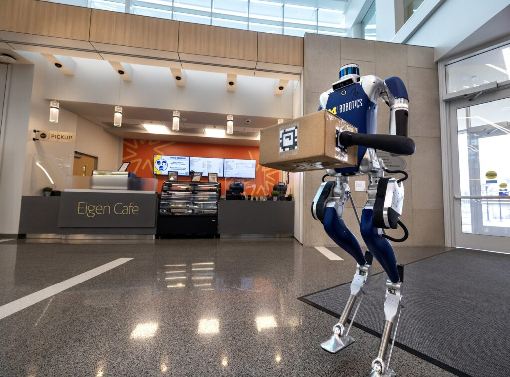

<figure>

<figcaption>

An Agility Robotics Digit bipedal robot carries a package into the Ford Motor Company Robotics Building at the University of Michigan. A new $1.2M NSF grant aims to innovate on the design of such legged robots.

</figcaption>

</figure>

Researchers at the University of Michigan have been [awarded a $1.2 million grant](https://www.nsf.gov/awardsearch/showAward?AWD_ID=2427036&HistoricalAwards=false) from the National Science Foundation (NSF) to enhance the design of humanoid legged robots, enabling their use in demanding situations such as warehouse labor and emergency response. The researchers will develop a new framework for designing energy-efficient robots by focusing on a specialized type of motors: Quasi-Direct-Drive (QDD) actuators with Unidirectional Parallel Spring (UPS) mechanisms.

“Preliminary simulations indicate a potential 20% improvement in locomotion energy efficiency,” said [Yanran Ding](https://robotics.umich.edu/profile/yanran-ding/ "Yanran Ding"), assistant professor of robotics and the project’s principal investigator.

<!--more-->

The interaction between the QDD actuator and UPS mechanism allows for high-torque and low-energy operation, enabling robotic systems to maintain higher performance with potentially lighter battery requirements. However, these specialized components add complexity to the design process that must take into account the new mechanical linkages in order to realize their benefits.

Contrary to the traditional design process of robotic systems, which often separates development of hardware and controls algorithms, the team will optimize the development of both aspects simultaneously in simulation.

“While spring-assisted electric motor systems for legged robots are not new, our research uniquely integrates mechanical design with control optimization to improve both energy efficiency and agility,” said [Robert Gregg](https://robotics.umich.edu/profile/robert-gregg/ "Robert Gregg"), associate professor of robotics and co-principal investigator.

“We will explore the combination of advanced simulation and model predictive control to iteratively refine robot designs, bridging the gap between mechanical and control engineering in the development of humanoid robots,” added Ding.

Beyond humanoid robots, the research could help develop customized actuators to enhance the energy performance of robotic leg prostheses and exoskeletons, providing advanced robotic assistance in everyday tasks.
