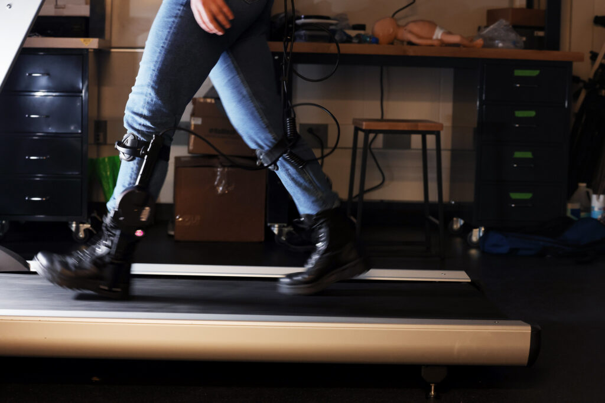

**Researchers assessed the impact of exoskeleton accuracy on walking behavior, working towards co-adaptive exoskeleton algorithms.**

<figure>

<figcaption>When a lower limb exoskeleton does not operate properly, some users recover their step quickly while others overcompensate with their hip or ankle. Credit: Brenda Ahearn, Michigan Engineering.</figcaption>
</figure>

When lower limb exoskeletons—mechanical structures worn on the leg—do not operate properly, some people adjust quickly while others compensate with their ankle or hip, expending more energy than necessary, according to a new study by University of Michigan researchers. 

The results, published in [_IEEE Robotics and Automation Letters_](https://doi.org/10.1109/LRA.2024.3366010)_,_ inform the development of future co-adaptive exoskeleton algorithms—meaning both the person and exoskeleton learn from and adjust to one another.

"Exoskeletons are a potentially very exciting technology to support mobility, but they also can create new cognitive demands and mental representations that people need to learn to use for them to be effective,” said [Leia Stirling,](https://ioe.engin.umich.edu/people/stirling-leia/) an associate professor of robotics and industrial and operations engineering and co-author on the paper. 

“It’s important to understand that not everybody will respond to technology in the same way,” added Stirling.

Lower limb exoskeletons must align with human goals, such as reducing the energy required to walk. The interplay of physical movements, cognitive decision making and technology must be considered to achieve this coordinated meshing between human and robot, known as fluency.

To improve fluency, exoskeletons are being designed to adjust to the wearer’s walking gait and the environment, but sometimes they make mistakes. Variability in the environment, the goals of the person or the device’s perception through its sensors can influence operations. 

To test how people respond to exoskeleton errors, study participants without disabilities walked on a treadmill while wearing a Dephy ExoBoot ankle exoskeleton on both legs. This model is designed to reduce muscle activation and energy expenditure for military applications. Researchers introduced an exoskeleton control algorithm with five different fixed error rates up to 10% error, or 90% accuracy, to investigate how accuracy influences walking behavior.

Using a motion capture camera system, the researchers assessed how people walked both when the exoskeleton operated as planned and when it did not actuate properly, or operate at the correct time, during a step.

“After a missed actuation, we saw that some people were still effectively using the system in following steps,” said Man I (Maggie) Wu, first author on the paper and a robotics doctoral student.

“However, we also observed compensatory mechanisms that would limit the usefulness of exoskeletons. For example, some participants started flexing their hips more after experiencing a missed actuation, even when the exoskeleton was activating with an appropriate timing,” added Wu.

Instances where users compensate for errors with the hip or ankle are best avoided as it requires additional muscle activation and energy.

“If the goal of the system is to increase someone's endurance by reducing the effort they need to provide, but the user is actually using more effort, that system would not be meeting the goals,” said Stirling.

Although this particular design was developed to increase endurance for people without disabilities, exoskeletons that support walking have the potential to assist people with mobility limitations from aging, injury or disease.

Exploring human-exoskeleton interaction can inform the development of exoskeleton algorithms equipped to support intuitive walking strategies for future users.

This work was funded by the National Science Foundation under Grant 1952279. Full citation: “Emergent gait strategies defined by cluster analysis when using imperfect exoskeleton algorithms,” Man I Wu and Leia Stirling, _IEEE Robotics and Automation Letters_ (2024). DOI: [10.1109/LRA.2024.3366010](https://doi.org/10.1109/LRA.2024.3366010).
