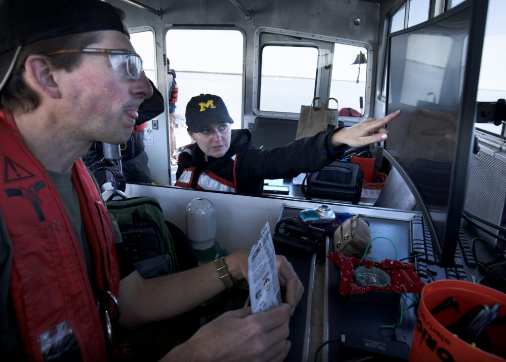

<figure>

<figcaption>Professor Katie Skinner discusses the freshly captured footage of a shipwreck Montana on board of the research vessel R/V Storm in Thunder Bay, Lake Huron. Photo by Marcin Szczepanski.</figcaption>
</figure>

[Katherine (Katie) Skinner](https://robotics.umich.edu/people/faculty/katie-skinner/ "Katie Skinner"), assistant professor of robotics, was awarded the National Science Foundation’s Faculty Early Career Development (CAREER) grant for a [project](https://www.nsf.gov/awardsearch/showAward?AWD_ID=2337774&HistoricalAwards=false) titled “CAREER: Adaptive Multimodal Fusion for Robust Robot Perception in Underwater Environments”, which aims “to provide new capabilities for marine robotic systems to map, visualize, and navigate underwater sites autonomously.”

“These new capabilities will be achieved using innovative machine learning methods to simultaneously capture the robot’s surroundings and pinpoint the robot’s location by combining acoustic and visual information,” the award abstract states. 

“Project outcomes will be demonstrated for use in archaeology by mapping historically significant shipwreck sites. The results will also apply to tasks such as underwater construction, infrastructure maintenance, and emergency response.”

Skinner leads the [Field Robotics Group](https://fieldrobotics.engin.umich.edu), whose work spans robotics, computer vision, and machine learning with a focus on enabling autonomy in dynamic, unstructured, or remote environments across sea, land, air, and space. 

The team’s work has included expeditions out to the Thunder Bay National Marine Sanctuary in Lake Huron, MI, known for its abundance of shipwrecks. Based on these research trips, with support from the NOAA Ocean Exploration Program, the team has developed new methods using machine learning to process data collected from underwater robots to automatically detect submerged objects and perform targeted surveys of detected sites. Data related to the team’s work in the sanctuary has been [publicly released](https://umfieldrobotics.github.io/ai4shipwrecks/) to expand access to data for shipwreck detection and ocean exploration.

The researchers’ work is not just applicable underwater: methods to improve sensing in the extreme undersea environment also lend to improving sensing on land for autonomous vehicles in urban environments. 

Skinner holds a courtesy appointment in the Department of Naval Architecture and Marine Engineering, and was a Postdoctoral Fellow in the Daniel Guggenheim School of Aerospace Engineering and the School of Earth and Atmospheric Sciences at Georgia Institute of Technology. She is also a recipient of the IEEE Robotics and Automation Letters Best Paper Award.

Notably, Skinner was one of the first PhD students in Robotics at the University of Michigan. Her work exemplifies how Michigan Robotics creates and leads innovative initiatives and robust programs that elevate outcomes for both robotics and roboticists in research, academics, and society.
