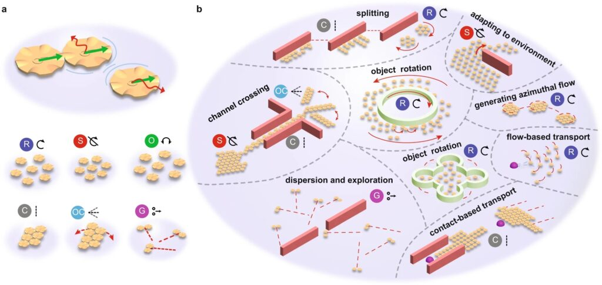
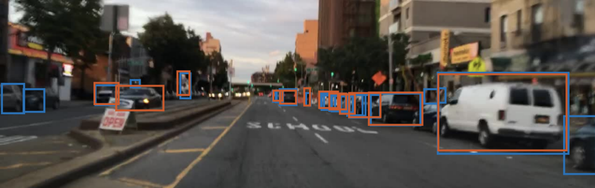
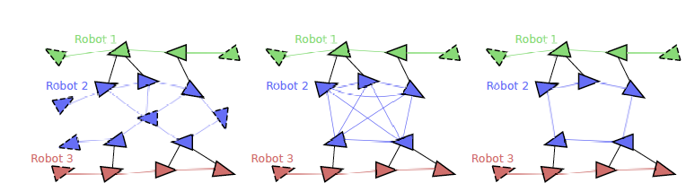

The Robotics Department at the University of Michigan thrives on the principle that collaboration multiplies the quality and impact of our work, and we’re excited to announce new faculty who each bring their own teaching and research expertise to the program.

Faculty joining us this year and next include:

- Bernadette Bucher

- Steven Ceron

- Xiaoxiao Du

- Yulun Tian

Read more about each below.

<!--more-->

## Bernadette Bucher

Bernadette Bucher joins Michigan Robotics this fall as an Assistant Professor with research in the intersection of computer vision, machine learning, and robotics. Bucher is working on learning interpretable visual representations and estimating their uncertainty for use in downstream science and robotics tasks with a particular interest in enabling robust and inquisitive autonomous mobile manipulation in novel and dynamic environments. Bucher earned a PhD in computer science in the GRASP lab at University of Pennsylvania, and previously worked as a research scientist at the Boston Dynamics AI Institute and as a senior software engineer at Lockheed Martin Corporation.

**Read one of Bucher’s latest papers:**

[VLFM: Vision-Language Frontier Maps for Zero-Shot Semantic Navigation](http://naoki.io/portfolio/vlfm.html)

## Steven Ceron

Steven Ceron will join Michigan Robotics as an Assistant Professor in January 2025 to work on research problems related to swarm robotics, including micron-scale robot swarms. Ceron earned a PhD in mechanical engineering at Cornell, and is currently a Distinguished Postdoctoral Fellow at Massachusetts Institute of Technology.

**Read one of Ceron's latest papers:**

[Microrobot collectives with reconfigurable morphologies, behaviors, and functions](https://www.nature.com/articles/s41467-022-29882-5#data-availability)

## Xiaoxiao Du

Xiaoxiao Du will now be a Lecturer in Robotics this fall, in addition to working as an Assistant Research Scientist. Du previously lectured in Electrical Engineering and Computer Science. Du’s research has focused on machine learning and computer vision for sensor data, which has been applied to predicting pedestrian movement, autonomous driving, remote sensing, and precision agriculture.

**Read one of Du's latest papers:**

[MIC-AQT: Improving Domain Adaptive Object Detection of Adversarial Query Transformers with Masked Image Consistency](http://xiaoxiaodu.net/wp-content/uploads/2024/01/IROS_Poster_Abstract_2023-1.pdf)

## Yulun Tian

Yulun Tian will join Michigan Robotics as an Assistant Professor in Fall 2025 to work on research problems in the areas of multi-agent systems, robot perception, and optimization. Tian earned a PhD in autonomous systems at Massachusetts Institute of Technology, and is currently a postdoctoral researcher at University of California, San Diego. 

**Read one of Tian's latest papers:**

[Spectral Sparsification for Communication-Efficient](https://arxiv.org/pdf/2210.05020) [Collaborative Rotation and Translation Estimation](https://arxiv.org/pdf/2210.05020)

