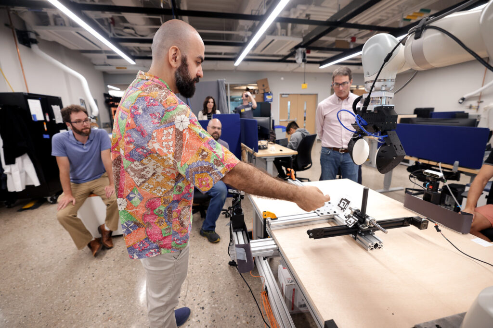

Nima Fazeli, assistant professor of robotics, was awarded the National Science Foundation’s Faculty Early Career Development (CAREER) grant for a [project](https://www.nsf.gov/awardsearch/showAward?AWD_ID=2337870&HistoricalAwards=false) “to realize intelligent and dexterous robots that seamlessly integrate vision and touch.”

“Touch provides robots with a wealth of knowledge from physical interactions and in many tasks it is crucial for success (e.g., reaching into a pocket or rummaging in through a grocery bag),” the award abstract states. “Integrating touch with the rapid progress in vision will accelerate the deployment of skilled and reliable robots from research settings into the real-world.”

<!--more-->

Fazeli leads the [Manipulation and Machine Intelligence Lab](https://www.mmintlab.com) whose focus is on enabling robots to autonomously interact with the physical world through touch, and centers his work on perception, learning, and controls through contact. The lab develops next generation algorithms, models, and hardware that hope to ultimately realize the promise of robotics – intelligent and dexterous systems that serve societal needs ranging from  in-home and assistive care to manufacturing and space exploration.

Fazeli has been recognized for his work with various awards and honors, including the Amazon Research Award in Robotics, Google Faculty Research award, a finalist for the Agilent Early Career Professor Award, and the Rosenhow Fellowship. He has further distinguished himself in academic competitions, with top rankings in the Amazon Robotics Challenges. His scholarly accomplishments include multiple award-winning papers at conferences such as Robotic Sciences and Systems (RSS), IEEE/RSJ International Conference on Intelligent Robots and Systems (IROS), and the International Symposium on Robotics Research (ISRR).

Fazeli and his work are an example of how Michigan Robotics enables and performs state-of-the-art research across fields, focus areas, and industries to create and test new approaches to the increasingly intricate problems of our world.
