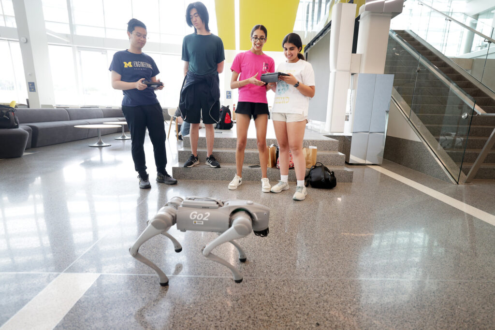

<VideoCenter url="https://youtube.com/shorts/W0MdweZPwbE" caption="High schoolers from the School at Marygrove in Detroit visited in June 2024, where they got hands-on experiences with quadruped robots, using augmented reality to control robots, and an overview of our MBot educational robotics platform." />

Michigan Robotics is committed to expanding access to and opportunities in robotics inside the department and across the nation, inspiring exploration within robotics across all ages, levels, and backgrounds. We do this by leveraging an open curriculum, shared platforms, community events, and distributed teaching initiatives.

We also encourage community outreach among our students by recognizing those who have gone above and beyond. Each year, we name these students as our Robotics Outreach Ambassadors, which signifies the elevated status they have earned through their service to the community.

In a new milestone since launching the program in 2021, this year's ambassadors collectively logged over 1000 hours of community service.

We congratulate the following Robotics Outreach Ambassadors of 2024:

<ColumnList columns={2}>

- Trushant Adeshara
- Arsha Ali
- Brandon Apodaca
- Zahraa Bazzi
- Kevin Best
- Zach Bons
- Emily Bywater
- Wami Dosunmu-Ogunbi
- Zariq George
- Trinh Huynh
- Seth Isaacson
- Nick Janne
- Jake Kanetis
- Luis Marques
- Jonathan Mi
- José Montes-Pérez
- Vinay Angara Venkata Nagendra
- Mark Nail
- Christopher Nestani
- Keith Ng
- Chinwendu Nwokeabia
- Jana Pavlasek
- Saket Pradhan
- Abigail Rafter
- Mohamad Louai Shehab
- Anja Sheppard
- Andrea Sipos
- Katharine Walters
- Yichen Wang
- Connor Williams
- Joey Wilson
- Yulun Zhuang
</ColumnList>

<figure>

<figcaption>Instructors including Yulun Zhuang worked with summer campers as they participate in the WISE GISE Summer Camp in June 2024. Photo: Brenda Ahearn/University of Michigan.</figcaption>
</figure>

These individuals contributed to a vast number of events that helped the community experience robotics and these roboticists experience community, including:

- Running the [University of Michigan Science Olympiad](https://www.umichscioly.org) Robotics portion

- Volunteering at a [University of Michigan's Adaptive Sports & Fitness](https://ssd.umich.edu/adaptive-sports) track meet

- Planning and running summer camp modules on all aspects of robotics from hardware to software with groups like [WISE GISE](https://wise.umich.edu/k-12-families-educators/wise-gise/), and [MI-LSAMP](https://sites.marsal.umich.edu/drpp/michigan-louis-stokes-alliance-for-minority-participation/), and the Office of Community, Culture, and Equity

- Hosting visits and conducting lab tours for primary school and prospective students, including [Marygrove High School](https://www.detroitk12.org/marygrove) and the [Hidden Genius Project](https://www.hiddengeniusproject.org)

- Mentoring FIRST Robotics teams throughout an entire season, including creating lesson plans to teach CAD and mechanical skills

- Participating in the [Society of Women Engineers](https://www.sweumich.org) High School Shadow Day, offering a glimpse into a roboticist's work

- Building robots with Michigan Girl Scouts to introduce them to robotics components

- Attending regional and international conferences such as IROS in Detroit, National Society of Black Engineers in Atlanta, IEEE RAS Summer School on Multi-Robot Systems in Prague

- Traveling to Liberia, Africa and preparing technical and professional development content to present at a conference in collaboration with SWE-Liberia

- Organizing and volunteering at STEMulation, an annual event organized by the [Graduate Society for Black Engineers and Scientists](https://gsbes.org) in collaboration with the [National Society of Black Engineers](https://nsbeum.weebly.com), to give 10th and 11th-grade students an opportunity to explore the various academic and career opportunities available in STEM fields

- Performing duties to strengthen student culture in the [Robotics Graduate Student Council](https://robotics.umich.edu/academics/student-services/robotics-graduate-student-council/), as members, board members, and leaders

We are so grateful to these exceptional students for their dedication and work in service to Michigan Robotics, and local and global communities. While their notable hours of service set them apart, we also recognize and appreciate the countless other students whose efforts, though undocumented, continue to positively impact those around them.