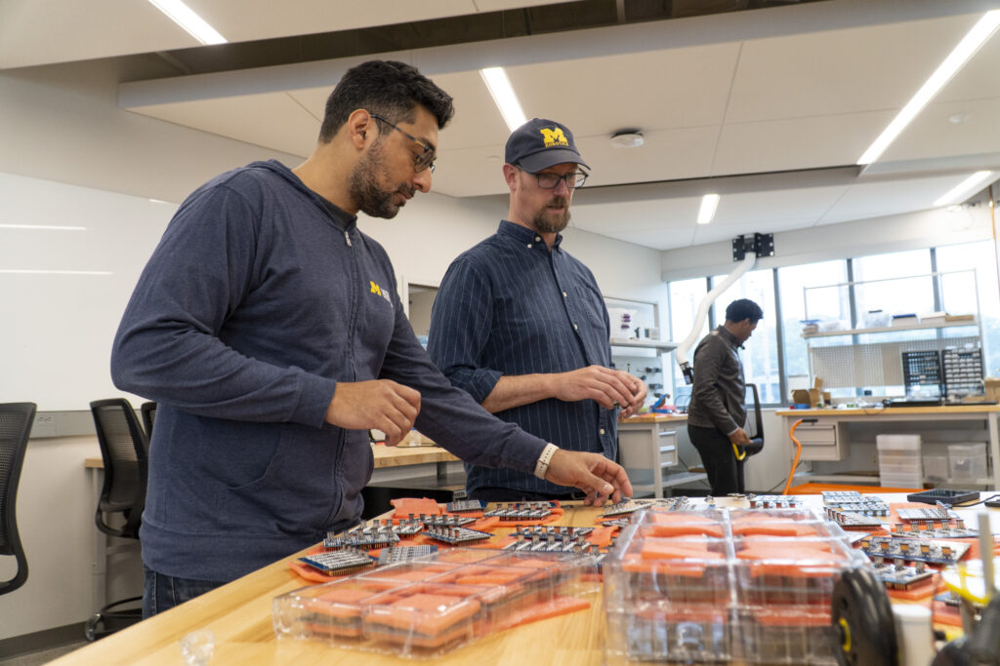

<figure>

<figcaption>

Abhishek Narula and Peter Gaskell check through an order of Mbot PICO+ chips in the summer before assembling the fall fleet of robots.

</figcaption>

</figure>

Robotics honors staff and faculty who create a welcoming community, exemplify our values, and allow our roboticists to prosper. We recognize such efforts in many ways, including through the College of Engineering Staff Incentive Program and the Robotics Departmental Faculty Award.

The Staff Incentive Program recognizes staff who consistently demonstrate the College’s [vision and mission](http://strategicvision.engin.umich.edu/). This initiative is part of the culture pillar of Michigan Engineering’s strategic plan.

This year’s Robotics recipients of the Staff Incentive Program are [Abhishek Narula](https://2024.robotics.umich.edu/profile/abhishek-narula/ "Abhishek Narula") and [Samantha Price](https://2024.robotics.umich.edu/profile/samantha-price/ "Samantha Price").

The Departmental Faculty Award recognizes faculty for high impact accomplishments benefiting the Department and the College.

This year's Robotics Department Faculty Award honors [Chad Jenkins](https://2024.robotics.umich.edu/profile/chad-jenkins/ "Chad Jenkins").

<!--more-->

Chad Jenkins, professor of robotics and Associate Chair of Undergraduate Studies, is responsible for leading the creation and development of the robotics undergraduate curriculum. This is the first such undergraduate robotics program at a top-ten engineering school. Since launching the program in 2022, the first two robotics majors graduated last year, and over 150 students have declared a robotics major. In addition, Jenkins has led the development of a distributed teaching collaborative, which co-creates and teaches robotics courses with students at other institutions who would not have had a chance to study such concepts, including students at Minority-Serving Institutions and Historically Black Colleges and Universities.

Abhishek Narula, Full Stack Engineer, develops and builds technologies to help courses and labs teach robotics concepts to students. Narula has been a key member of the [Mbot](http://mbot.2024.robotics.umich.edu) team, which is the mobile, educational robot platform underlying a significant number of robotics classes. Narula helps manage the over 300 Mbots in the department fleet, and works tightly with instructors and students to meet the growing needs of the department.

Samantha Price, Human Resources Generalist, has overseen the tremendous growth in headcount since the Robotics Department was formed. Price is one of the first contacts of prospective faculty and staff, and represents the Department’s welcoming, respectful, and highly capable culture. Price joined the College of Engineering from the Shared Services Center, and has quickly exceeded the bar in understanding and navigating the numerous procedures and scenarios that managing Engineering faculty and staff present.

Their dedication and continuous efforts have played a critical role in creating a nurturing environment for students, faculty and staff. We are excited to recognize them through this year's Staff Incentive Program and Departmental Faculty Award. We look forward to honoring future staff and faculty with these awards, and to elevate the exceptional work done across the department.
