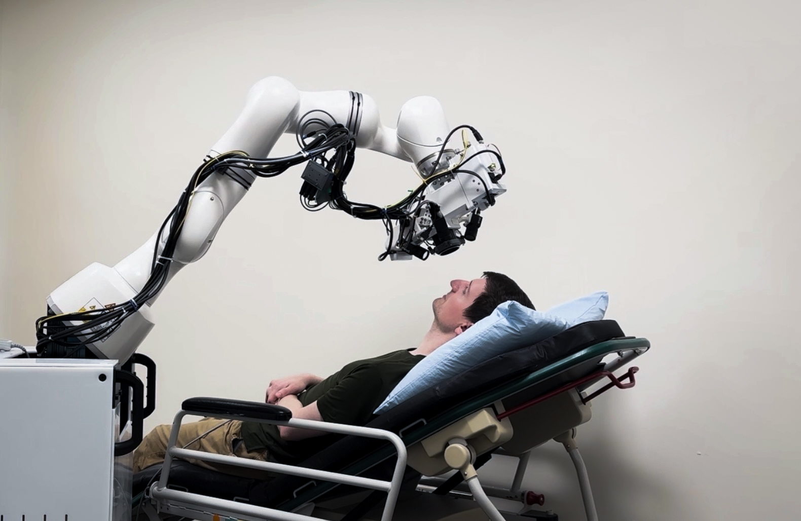
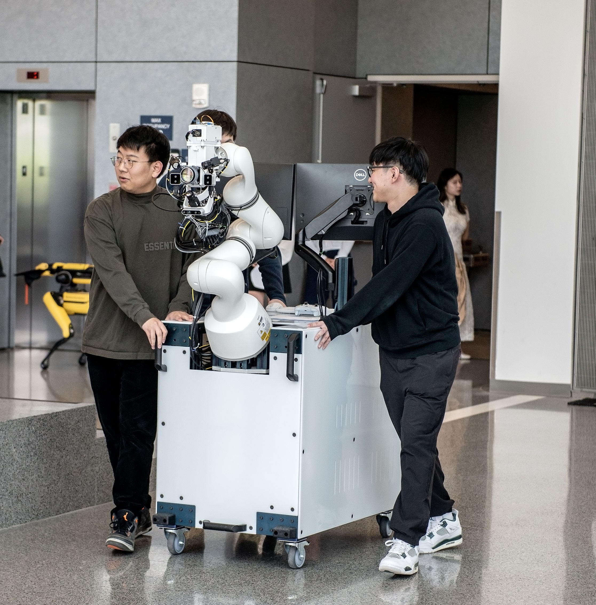

<figure>

  

  <figcaption>A demonstration of the mobile robotic optical coherence tomography system adapting its position to a reclining subject. Credit: Paper authors.</figcaption>
</figure>

Resting your chin on a device at the eye doctor is a common practice, but a new robotic solution can help bring the latest diagnostic ophthalmology equipment to the patient in whatever position they are comfortable. This enables patients with limited mobility or motor deficits to more easily access more advanced care.

To achieve this, researchers at the University of Michigan integrated an optical coherence tomography (OCT) scanner, capable of taking cross-section images of the eye at resolution in a handful of micrometers, onto a mobile system made up of a robot arm and wheeled cart that could be deployed into any exam room.

“The new system can safely position the scanner to accurately image the eye if a patient is sitting, reclining, or lying down,” said Dr. Mark Draelos, professor of robotics and ophthalmology.

“It also compensates for patient movement, such as breathing, by tracking the patient’s face and eyes while utilizing obstacle avoidance.”

OCT is a standard tool for the diagnosis and treatment guidance of many eye diseases such as glaucoma and macular degeneration. Due to its sensitivity and high resolution, traditional OCT is typically mounted onto a table, and requires the patient to sit still and upright. Handheld OCT exists, but requires a highly trained operator with very steady hands. Any movement as small as a millimeter can become an artifact on the final image.

<figure>

  

  <figcaption>The system’s mobile nature allows it to be wheeled wherever it is needed in outpatient or inpatient settings. Credit: Adam Southard.</figcaption>
</figure>

“A major challenge for the system is automating the position of the scanner safely in front of the patient’s eye,” said Genggeng Zhou, a PhD student in robotics and first author of the associated paper.

“To do this, we utilize three face tracking cameras, one of which also helps to image the surrounding environment, and three pupil tracking cameras.”

These cameras provide the data needed to avoid any obstacles in a room when paired with a real-time motion planner, and compensate for any misalignment or delay of the tracking system itself when imaging.

The team brought the setup to exam rooms at Kellogg Clinical Research Center for further testing, where the robot was able to align to a face without any collisions.

Before real-world use, there are a few refinements researchers hope to make. This includes improving the face tracking algorithm to perform better when only part of a face is visible, and more efficient collision checking algorithms to speed up motion planning.

The work, titled [“Mobile Robotic Optical Coherence Tomography System for Ophthalmic Imaging in Clinical Environments](https://ieeexplore.ieee.org/document/11025963/authors#authors),“ was presented at the [2025 International Symposium on Medical Robotics (ISMR)](https://ismr.gatech.edu/2025/2025-welcome), where it was awarded second place for Best Paper Award.

Additional authors include Haochi Pan, Samantha Staudinger, Yuchen Wang, Jiawei Liu, and Catherine Jin, of Michigan Robotics, Salma Fleifil, Nita Valikodath, of Michigan Medicine, and Ryan P. McNabb and Anthony N. Kuo, of Duke University.

Funding was provided by the National Eye Institute of the National Institutes of Health (R00 EY034200 and R01EY035534).