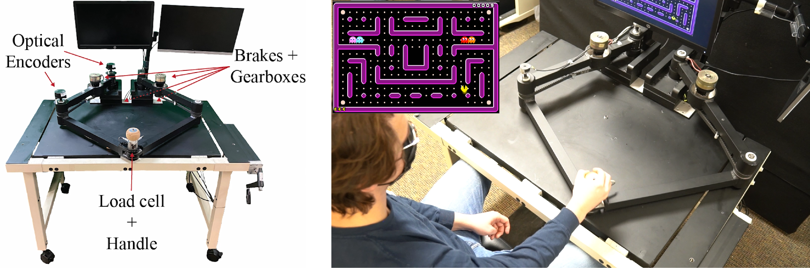

<VideoCenter url="https://www.youtube.com/watch?v=47tdyQEsAIY"  caption="Thomas Augenstein covers his work on low-cost technologies for stroke rehabilitation, including SepaRRo and the Hand eMbot."/>

Thomas E Augenstein, a PhD candidate in robotics, has been awarded the 2025 Richard and Eleanor Towner Prize for Outstanding PhD Research. This highly competitive award selects only three student winners each year from across all College of Engineering departments and programs at the University of Michigan, highlighting exceptional creativity and research achievements.

"The award recognizes Tom's extraordinary dedication and innovative contributions to stroke rehabilitation research over the past five years," said Dr. Chandramouli Krishnan, Director of the [Neuromuscular and Rehabilitation Robotics Laboratory (NeuRRo Lab)](https://neurro-lab.engin.umich.edu).

Augenstein’s dissertation, "Development and Application of Low-cost Technologies for Stroke Rehabilitation," focuses on creating low-cost rehabilitation devices for stroke survivors who suffer from debilitating arm or leg impairment. He accomplishes this by building devices that use passive or semi-passive force generation elements (springs or computer-controlled brakes) to produce training forces instead of motors. In his view, these devices are more likely to translate to clinical or home environments because they circumvent the necessary hardware and safety considerations that make motorized systems so expensive and bulky. However, passive and semi-passive elements reduce the capabilities of a device as compared to motorized systems. Therefore, a large portion of Augenstein’s work focuses on understanding how his devices can facilitate biomechanical and neurophysiological adaptations that lead to improved limb function. His work bridges the gap between robotics and rehabilitation science, addressing a critical need for affordable and effective stroke rehabilitation technologies.

An example of Augenstein’s projects is SepaRRo, a semi-passive tabletop robot that uses computer-controlled brakes to steer a user’s arm motion. In his work with stroke survivors, he shows that these steering forces alter muscle coordination and break up abnormal post-stroke synergies, which are involuntary coupling of motion between joints. He also shows that, by using a different control algorithm, these steering forces can also guide motion along a path. In rehabilitation, this guidance can be used to help stroke survivors draw shapes and letters to facilitate relearning of these lost skills. 

<figure>

  

  <figcaption>SepaRRo is another of Augenstein’s low-cost robots for stroke rehabilitation.</figcaption>
</figure>

"In our research, we're not just developing technologies—we're fundamentally rethinking how rehabilitation can be made more accessible and effective for stroke survivors," Augenstein explained.

In 2019, Augenstein received the National Science Foundation (NSF) Graduate Research Fellowship Award, selected from a competitive pool of over 15,000 applicants. His proposal focused on developing SepaRRo and implementing controllers for retraining muscle synergies in stroke survivors.

Before starting his PhD program at Michigan Robotics in Fall 2019, Augenstein completed his Master's degree in Mechanical Engineering at the University of Michigan and his Bachelor's degree in Mechanical and Aerospace Engineering at Cornell University.

During his academic career, Augenstein has 20 peer-reviewed publications (18 during his time at NeuRRo Lab, with 11 as first or co-first author), three pre-prints, three prestigious fellowships, eight research grants, two invited presentations, 12 oral presentations and research abstracts, and two patent disclosures.

His research spans various aspects of rehabilitation robotics, including:
- Enhancing mirror therapy in stroke rehabilitation with virtual reality
- Developing passive elastic and viscous leg exoskeletons for resistive gait training
- Designing self-powered robots to improve post-stroke hand function 
- Studying how functional resistance training affects gait biomechanics
- Using brain stimulation and motor module analysis to study muscle coordination in reaching movements
- Examining how neuroscientific principles like motor learning can influence post-stroke rehabilitation 

Beyond research, Augenstein participates in enthusiastic outreach, a key value of Michigan Robotics. In addition to mentoring over 40 students in the past five years, he serves as a journal reviewer, and performs local outreach. For one outreach event, Augenstein led middle school students from Avalon Housing in hands-on experiences with rehabilitation technologies such as EMG, EEG, and motion capture. Along with Dr. Krishnan, he is also currently mentoring Tappan middle schoolers for the FIRST Tech robotics competition.

Augenstein plans to defend his dissertation on April 30, 2025. His research at the intersection of robotics and rehabilitation medicine exemplifies the innovative and interdisciplinary approach championed by Michigan Robotics, and his commitment to community sets the bar for other roboticists.
