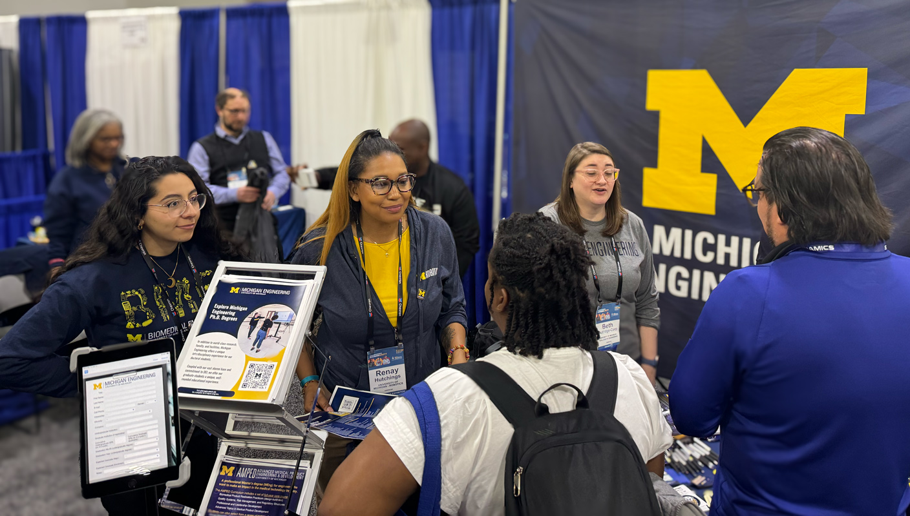

<figure>
  

  <figcaption>Renay Hutchings attended NSBE 2024 to represent the Michigan Robotics.</figcaption>
</figure>

The Robotics Department aims to be an environment for creative collaboration that enables the work across boundaries needed to develop robotics. There are always many efforts happening to achieve this goal. We try to recognize such efforts in several ways, including through the College of Engineering Staff Incentive Program and the Robotics Departmental Faculty Award.

The Staff Incentive Program recognizes staff who consistently demonstrate the College's [vision and mission](http://strategicvision.engin.umich.edu/). This initiative is part of the culture pillar of Michigan Engineering's strategic plan.

This year's Robotics recipients of the Staff Incentive Program are [Kayla Dombrowski](https://robotics.umich.edu/people/staff/kayla-dombrowski/) and [Renay Hutchings](https://robotics.umich.edu/people/staff/t-renay-hutchings/).

The Departmental Faculty Award recognizes faculty for high impact accomplishments benefiting the Department and the College.

This year's Robotics Department Faculty Award honors [Brent Gillespie](https://robotics.umich.edu/people/faculty/brent-gillespie/).

Brent Gillespie, professor of robotics and Associate Chair of Graduate Studies, has been a fantastic advocate for our graduate students. Gillespie has developed a series of engaging events to support our students, including student orientations, grant writing workshops, research fairs, CQE preparation events, graduate student coffee hours, and information sessions about transitioning from the MS to the PhD programs. The level of dedication needed to lead the graduate program–in addition to regular duties–is immense, and the dedication Gillespie has shown is a testament to his commitment to our students.

Kayla Dombrowski, Curriculum Coordinator, has been a key member of the Robotics Department's growing undergraduate program. Dombrowski has helped organize and arrange the numerous new courses on order to meet the needs of the new curriclum, as well as pioneered new ways to serve this information to students. One such effort is a [searchable dataset of all robotics courses](https://robotics.umich.edu/academics/courses/complete-course-list/), along with their specific requirements. This is in addition to developing related undergraduate policies the new major requires, and being a highly collaborative team member.

Renay Hutchings, Creative Administrative Coordinator, has helped the department culture grow and thrive. Early on, Hutchings helped organize the off-site Robotics Art Show with local artists as part of the 2023 IEEE/RSJ International Conference on Intelligent Robots and Systems in Detroit. She has also served on the programming committee for the Everyday Activity Science and Engineering (EASE) Fall School, working remotely with organizers in Bremen, Germany. Hutchings has represented Michigan Robotics at many conferences, such as CMD-IT Tapia Conference, SHPE, and NSBE, as well as managed the numerous in-person tour requests for the Ford Robotics Building. She also enhances community through graduate recruitment, retention and outreach. Hutchings fosters inclusivity and supports our students' connection with the department.

These staff and faculty have contributed to a Michigan Robotics Department that practices robotics with respect, fostering a community with strong communication, transparency in thought, and an openness to ideas and voices. We thank them, as well as those who have made other contributions, for bettering the department.