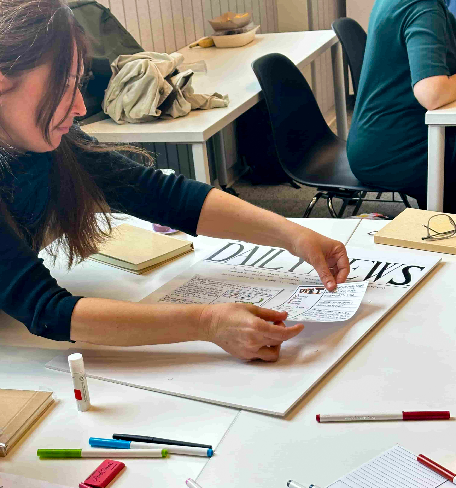

<VideoCenter url="https://www.youtube.com/watch?v=Z4hTQ4E3AgE" />

Robotics experts across fields of engineering, design, sociology, ethics, and human-computer interaction came together earlier this year in NewLab Detroit to envision the future of robotic design in society at the first [Design Retreat for Human-Robot Interaction](https://hridesignretreat.com) (HRI).

The Design Retreat was co-organized by [Patrícia Alves-Oliveira](https://patricialvesoliveira.com/), assistant professor of Robotics at the University of Michigan, and [Anastasia Kouvaras Ostrowski](https://www.akostrowski.com/), assistant professor in the School of Applied and Creative Computing with a courtesy appointment in the School of Mechanical Engineering at Purdue University.

"There's so many different conceptualizations of what design for HRI can be," said Anastasia Kouvaras Ostrowski. "We wanted to think further about what is the future roadmap, ten year plan, and also what support do we need to make these visions become a reality."

"This is why we brought experts around the world from the industry and academic perspectives to help shape that definition," said Patrícia Alves-Oliveira.

Alves-Oliveira also noted an example challenge for the field that provides opportunity for design. "Going from a very well crafted demo to a robust system that can work in the house is a huge challenge that we've been trying to solve for years - but every family is different," she said.

"Every robot will have to be different. And how can we build that?"

In the one and a half days of the Design Retreat, participants performed activities ranging from metaphor creation, backcasting, design fictions, to zine-making, with the ultimate goal of visioning on the future of HRI. The exercises required participants to imagine how robots would appear in a futuristic newspaper, and attempted "backcasting" to build the steps from the current present to the envisioned future.

The spirit of the Design Retreat is continuing with a workshop accepted to the 2026 ACM/IEEE Conference on Human-Robot Interaction called "3rd Workshop on Designerly HRI: Articulating the Value of Design Research for HRI". The organizers welcome submissions from everyone who is interested in diving deeper into Design work within HRI, as well as invite them to attend the workshop.

The HRI Design Retreat materials are [available on Github](https://github.com/studiorobot/hri-design-retreat/tree/main) for anyone who wants to use them for education, research, and outreach.

The HRI Design Retreat was funded by the National Science Foundation (Grant 24-PAF08983).
