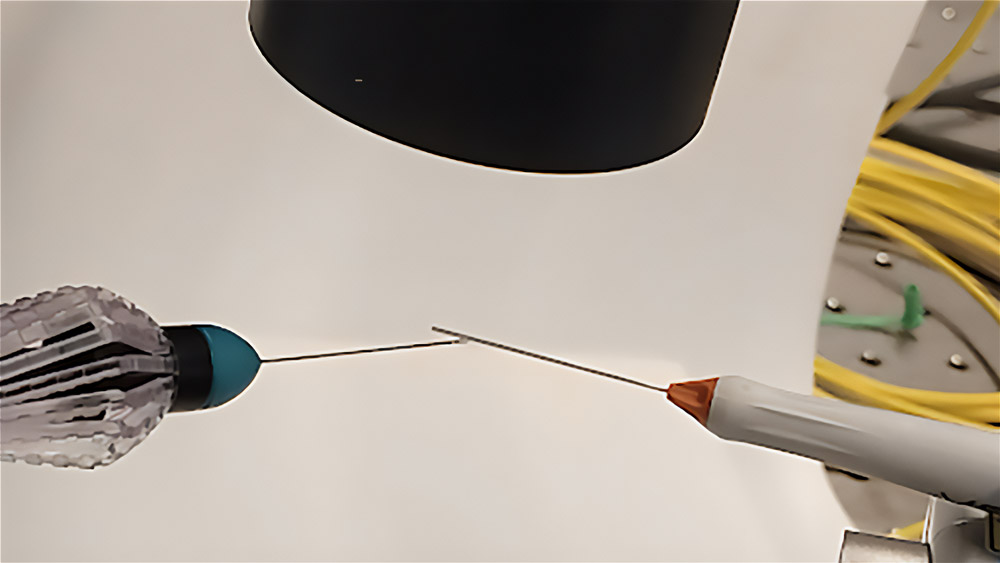

<figure>
  

  <figcaption>Setup for real-time live imaging using optical coherence tomography with surgical forceps. Credit: Paper authors.</figcaption>
</figure>

Researchers at the University of Michigan developed a new machine-learning approach to enhance the efficiency and accuracy of optical coherence tomography (OCT) imaging, a widely used tool in ophthalmology, cardiology, and other medical fields. This approach, described in [a study published in Biomedical Optics Express](https://opg.optica.org/boe/fulltext.cfm?uri=boe-16-1-186&id=565833), improved framerate by 40% with no drop-off in image resolution.

“Several issues with OCT stem from motion: a patient’s breathing, heartbeat, and eye movements can all create motion artifacts that distort and degrade the image,” said [Dr. Mark Draelos](/people/faculty/mark-draelos/), professor of ophthalmology and robotics.

The research team proposed two machine learning-based adaptive scanning methods that help predict scene dynamics and optimize scanning patterns. The models enable OCT systems to selectively focus on regions of interest without sacrificing image quality or speed.

“By intelligently focusing on areas of interest within a scene, instead of scanning the entire field, we can break the traditional relationship between framerate and resolution,” said Dhyey Manish Rajani, first author on the paper. 

“Using past and current data to predict changes in the scene, we achieve faster imaging without compromising quality, allowing us to adapt efficiently to changes in real time."

The potential applications of this work apply across medicine, but particularly in surgical guidance and diagnostics. To demonstrate this, the research team tested real-time live imaging and tracking of surgical forceps and probe movement, showing a 3x increase in speed and efficiency of the imaging.

The method, however, is currently computationally complex. The team had to downsample frames in order to create a manageable dataset, which meant finer details were sacrificed. Future work on this might include improving computational scalability, which would also help the method’s ability to capture details in low-contrast conditions.

Additional authors on the study include Federico Seghizzi, Yang-Lun Lai, and Koerner Gray Buchta. The research was supported by the National Institutes of Health (R00 EY034200, R01 EY035534).