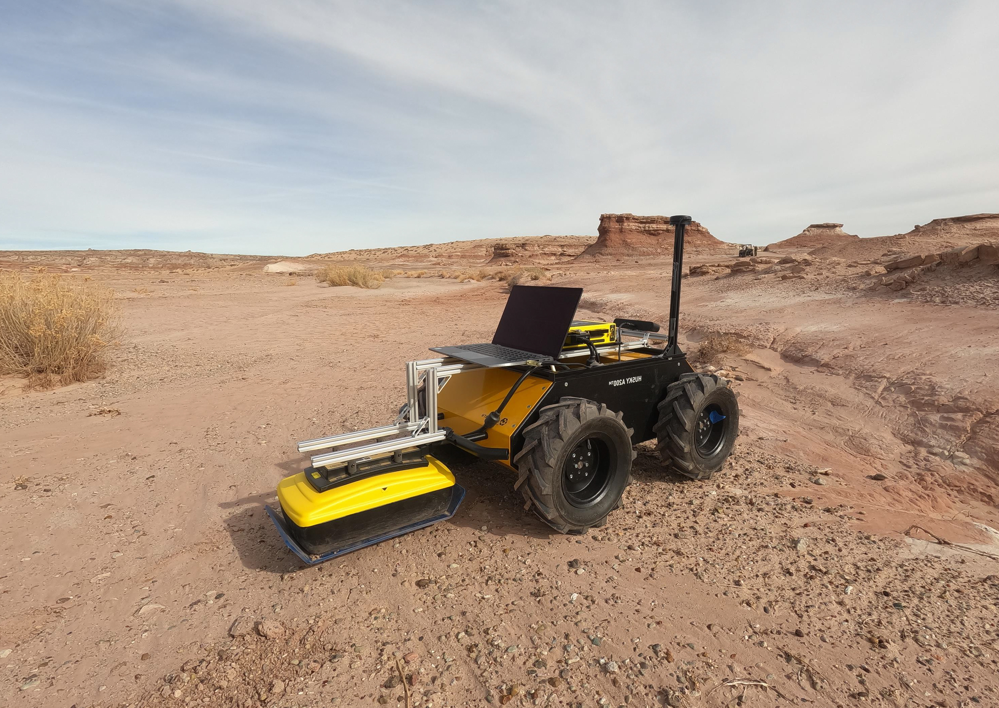

<figure>

  

  <figcaption>A robot in the Utah desert collects ground penetrating radar data, which can be added to existing robot localization methods to improve position accuracy when moving around rough terrain. Credit: Anja Sheppard.</figcaption>
</figure>

By incorporating scans from ground penetrating radar (GPR) into a planetary rover's localization system, University of Michigan researchers could help rovers traverse planets more accurately in environments where wheels often slip, like the sandy soils of Mars.

While Earth is surrounded by a security blanket of GPS satellites that help its residents triangulate their location, finding the right path while on other planetary bodies requires other tools. These tools typically include wheel encoders and inertial measurement units, which measure wheel rotation and changes in orientation and acceleration, and visual odometry, which tracks features between sequential images to characterize the robot's motion. Rovers can also rely on humans to manually correct their reported position. However, wheels do tend to slip or sink on certain soils, which can cause inaccurate data and visual odometry requires significant computational resources with the limited hardware that rovers carry.

"By integrating ground penetrating radar with current localization methods, we demonstrated improved accuracy in Martian environments," said Anja Sheppard, PhD candidate in Robotics.

"The ground penetrating radar on the Perseverance rover, which is currently on Mars, has been used to study Martian geology and search for water. This approach offers an additional use in localization: one that is less computationally intensive than visual odometry and less affected by weather and wheels."

To utilize the GPR data, Sheppard developed GPRFormer, a deep learning transformer-based model that predicts relative displacement from GPR scans, called traces. Each trace includes 200 data points of subsurface radiowave reflectivity at varying levels, and multiple traces are stacked together to create a 2D image of underground features. These predictions are then integrated with inertial and wheel encoder data in an Extended Kalman Filter (EKF) framework, a common method to estimate robot position and motion, to provide real-time rover localization.

To help evaluate the work, Sheppard collected a new dataset, MarsLGPR, at the Mars Desert Research Station in Utah: a site with many geologic similarities to the Martian surface. This dataset, which includes GPR, stereo camera, IMU, and robot wheel encoder data, [will soon be available](https://umfieldrobotics.github.io/marslgpr/).

In testing, including GPR data improved accuracy with the MarsLGPR dataset compared with wheel encoders alone. When compared to another GPR dataset collected on flat concrete surfaces, where wheel slip is minimal and wheel encoders are much more accurate, inclusion of GPR data did not show improvement.

“Space missions present many challenges for robotics with tight constraints,” said [Katie Skinner](/people/faculty/katie-skinner/), assistant professor of robotics.

“Our solution works within these constraints with sensors already available on rovers.”

The related paper, "[MarsLGPR: Mars Rover Localization with Ground Penetrating Radar](https://ieeexplore.ieee.org/document/11225894)," is published in IEEE Transactions on Field Robotics. The work was supported in part by the National Science Foundation (Grant DGE 2241144), the University of Michigan Space Institute Pathfinder Grant, the NASA Pennsylvania Space Grant Consortium (PSGC) Mini-Grants Program, and Duquesne BME departmental funds.
