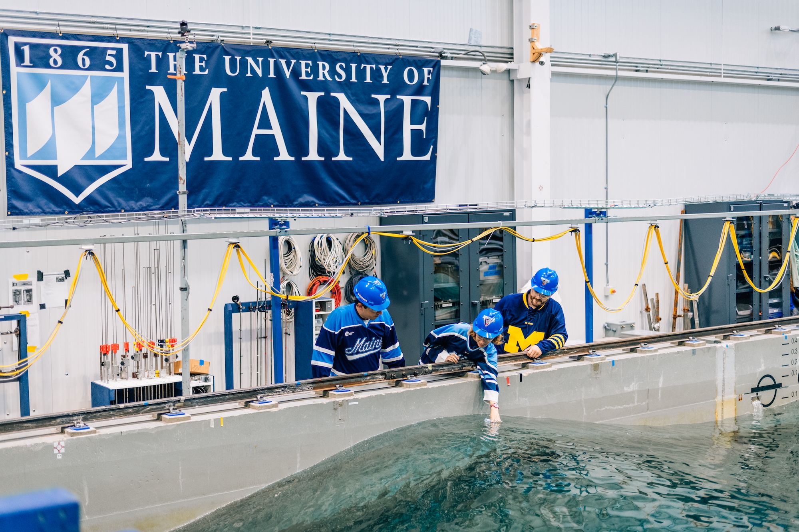
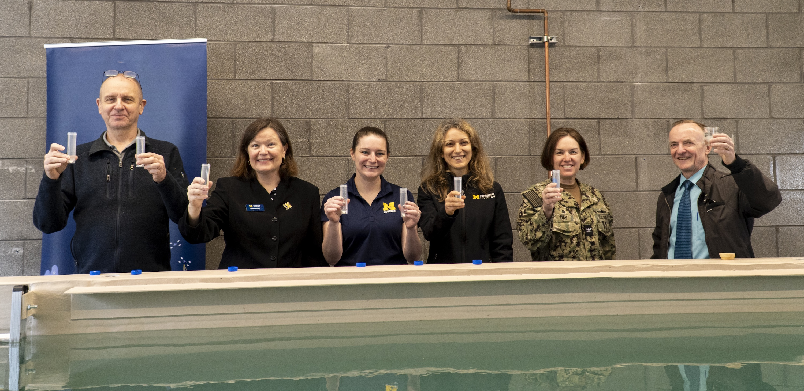

<VideoCenter url="https://youtu.be/CxkPDz2u3UY" />

A new 10,000 gallon water tank at the University of Michigan will help researchers design, build, and test a variety of autonomous underwater systems that could help robots map lakes and oceans and conduct inspections of ships and bridges. The tank, funded by the Office of Naval Research, allows roboticists to further test projects on robot control and behavior, marine sensing and perception, and multi-vehicle coordination.

“Marine autonomy is an important focus for roboticists: underwater environments are among the most challenging for robots to sense and communicate in,” said [Dimitra Panagou](/people/faculty/dimitra-panagou/), professor of robotics and aerospace engineering, and principal investigator on the project.

“This new tank, situated right next to our research labs, makerspace, student teams, and classrooms, will allow for fast iteration of designing, building, and testing of, as well as learning about autonomous systems that interact with water.”

The tank, 10 feet wide, 17 feet long, and 6.5 feet deep, is large enough to support swarms of autonomous underwater vehicles, as well as test remotely operated vehicles and autonomous surface vehicles. A twin motion capture system for above and below water, a ramp and lift to safely and easily move equipment, and support for underwater stereo cameras and acoustic sensors add to the tank’s capabilities.

A sample of research projects from co-principal investigators that will utilize the tank include:
- For Panagou, testing the safety and security of multi-robot systems, already tested on land and in the air, in the water to offer new insights on their performance and robustness.
- For Professor [Katie Skinner](/people/faculty/katie-skinner/), rapidly testing and validating state estimation and scene reconstruction capabilities for autonomous marine robotics.
- For Professor [Necmiye Ozay](/people/faculty/necmiye-ozay/), testing out verifiable, safe, artificial intelligence-enable dynamical systems in the underwater environment, which presents communication delays and missing data.
- For Professor [Maani Ghaffari](/people/faculty/maani-ghaffari/), developing mapping and trajectory optimization algorithms for autonomous robots as they transition between land and water, or above and underwater.
- For Professor [Jing Sun](https://name.engin.umich.edu/people/sun-jing/), testing marine energy harvesting scaled prototype models and validating control and health monitoring algorithms.

<VideoCenter url="https://www.youtube.com/watch?v=UtNK1Ite8no" />

The tank, now installed in the Ford Motor Company Robotics Building, joins other on-campus state-of-the-art robotics testing environments including M-Air, an outdoor land and air-based autonomous system testing facility, and Mcity, an autonomous vehicle testing ground. It also complements the [Aaron Friedman Marine Hydrodynamics Laboratory](https://mhl.engin.umich.edu), which features a tow tank and wind-wave tank–as part of the [Naval Architecture and Marine Engineering Department](https://name.engin.umich.edu).

A tradition when opening a new research water tank is to add samples from existing water tanks.

“The lore is that this helps to jumpstart research, as each testing tank is a living reservoir for all of the knowledge gained from within it,” said Jason Bundoff, Lead Engineer in Research at U-M’s Friedman Marine Hydrodynamics Laboratory.

“You mix the waters from other tanks to imbue the newly founded tank with all of that living knowledge from the other tanks, which helps to keep the knowledge from being lost.”

<figure>

  

  <figcaption>University of Maine researchers grab a sample to donate to the new Michigan water tank. Pictured from left to right, Nathan Faessler, full time basin staff engineer, Dorothy Ives, sophomore studying civil engineering, and Dr. Jacob Ward, U-M NAME MS 2016 alum.</figcaption>
</figure>

Following the myth, in addition to U-M’s tank, we asked several existing tanks from around the country for samples, including:

* U-M’s own Marine Hydrodynamics Lab: this water sample was delivered in a wooden case made from runners of the original 1904 tank.  
* [Oregon State University’s O.H. Hinsdale Wave Research Laboratory](https://engineering.oregonstate.edu/wave-lab), which features the largest nearshore experimental facility at an academic institution in the US, including the Large Wave Flume (LWF) and Directional Wave Basin  
* [Stevens Institute of Technology’s Davidson Laboratory](https://www.stevens.edu/davidson-laboratory/facilities), which features a high-speed towing and wave tank, as well as the oblique sea basin, one of only two of its kind in the United States.  
* [University of Maine’s Alfond W2 (wind wave) Ocean Engineering Lab](https://composites.umaine.edu/oee-facilities/), which features a 1:50-scale offshore model testing facility that accurately simulates towing tests, variable water depths, and scaled wind and wave conditions that represent some of the worst storms possible anywhere on Earth.  
* [University of Minnesota’s St. Anthony Falls Laboratory](https://cse.umn.edu/safl), on the Mississippi River which features seven flumes and channels, five model basins, two water tunnels, one wind tunnel, three calibration facilities, and the Outdoor StreamLab.  
* [University of New Orleans Tow Tank](https://www.uno.edu/academics/coe/name/facilities/towing-tank), the largest experimental facility in the UNO College of Engineering, which tests scale models of ships, offshore structures, and ocean engineering vehicles and instrumentation.   
* The [University of Washington’s Harris Hydraulics Lab](https://www.pmec.us/testing/harris-hydraulics-lab), which features the Alice C. Tyler flume, oscillation visualization tank, the Washington Air-Sea Interaction Research Facility, and a tidal flow facility. Both Universities of Washington and Oregon are also members of the [Pacific Marine Engineering Center](https://www.pmec.us).  
* United States Naval Academy’s [Hydromechanics Laboratory](https://usna.edu/Hydromechanics/Archive.php#panel1FacilityHistory), which includes a 380 foot tow tank opened in 1976 and supports including coursework, independent research, faculty research, and sponsored testing. 

Beyond research, the tank will support student teams focused on marine autonomous systems, such as [UM::Autonomy](http://www.umautonomy.com/), [Michigan Robosub](https://maizepages.umich.edu/organization/michiganrobosub), and U-M RobotX as they build new vehicles for annual competitions. The tank also enables hands-on coursework activities at the undergraduate and graduate level, in courses such as [ROB 103: Robotic Systems](https://robotics.umich.edu/news/2021/building-the-basics-in-rob-103-robotic-systems/), and NAVARCH 599: Marine Robotics.

“It’s facilities like this that set the College of Engineering and the University of Michigan apart,” said Eric Michielssen, associate dean for research at Michigan Engineering and the Louise Ganiard Johnson Professor of Engineering in electrical and computer engineering.

“With support from the Office of Naval Research, this opens up many, many new opportunities for Michigan students and faculty to work across the different domains of land, sea, and air.”

<figure>

  

  <figcaption>Eric Michielssen, Dawn Tilbury, Katie Skinner, Dimitra Panagou, Captain Michele Day, and David Dowling hold up water samples from around the country before pouring them into the new research water tank at the University of Michigan Ford Motor Company Robotics Building.</figcaption>
 </figure> 