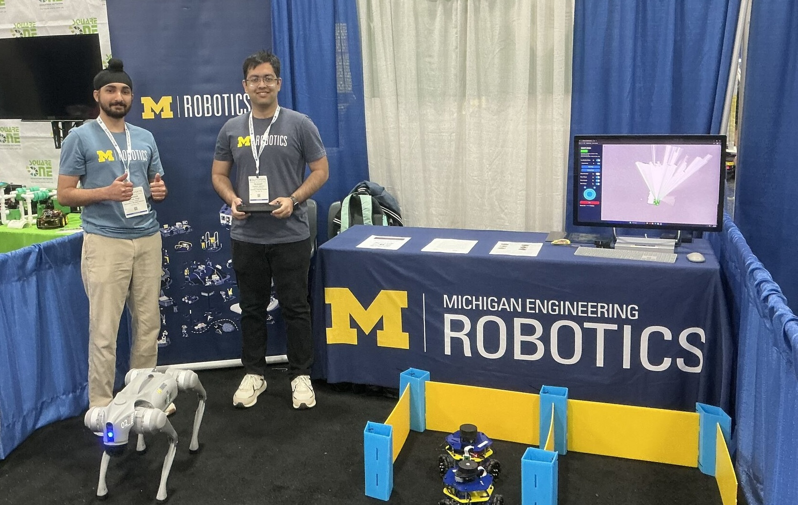

<figure>

<figcaption>

Trushant Adeshara and Manveer Singh demonstrate MBot and a quadruped robot at the Michigan Robotics booth during the Automate conference.

</figcaption>

</figure>

We instill within Michigan roboticists a [set of values](/about/values) to help guide their work. One of these values is *enthusiastic for outreach*. 

Our outreach efforts serve three purposes: building for and inspiring the next generation of roboticists, informing policies that benefit society, and fostering public understanding of where robotics is as a field right now.

Enthusiastic outreach takes many forms—from contributing open-source code to engaging at large-scale educational events. Each approach strengthens the broader field of robotics.

Within our own community, sharing diverse expertise and experiences ultimately advance both our research and our people.

There are a select set of our community members who have put forth notable effort toward outreach. These students earn the Robotics Outreach Ambassador title, which is in recognition of their outreach work that is in addition to a student's typical research and coursework.

We congratulate the following Robotics Outreach Ambassadors of 2025:

<ColumnList columns={2}>

- Trushant Adeshara
- Arsha Ali
- Brandon Apodaca
- Zahraa Bazzi
- Emily Bywater
- Jessica Carlson
- Jiawei Chen
- Cale Colony
- Zariq George
- Seth Isaacson
- Luís Marques
- Reina Mezher
- Miranda Mittleman
- Keith Ng
- Abigail Rafter
- Anja Sheppard
- Manveer Singh
- Sacchin Sundar
- Katharine Walters
- Connor Williams
- Yulun Zhuang
- Zikai Zhou

</ColumnList>

<figure>

<figcaption>

Brandon Apodaca closes the formal program at the inaugural ROBOSYM graduate research symposium that he organized.

</figcaption>

</figure>

These individuals contributed to a vast number of activities and events across a wide range of communities, including:

- Volunteering as judges and Control Systems Advisors at FIRST Robotics competitions, helping teams troubleshoot robots and providing technical guidance

- Organizing and volunteering at STEMulation 2025, providing STEM and college preparatory experiences for minority and underserved high school students in collaboration with the [Graduate Society for Black Engineers and Scientists](https://gsbes.org) and [National Society of Black Engineers](https://nsbeum.weebly.com)

- Staffing the UM Robotics booth at conferences and industry events like SWE and Automate to answer questions about the program and demonstrate robotics

- Mentoring FIRST Robotics teams throughout entire seasons, including regular team meetings, weekend competitions, and state championships

- Conducting extensive lab tours for prospective graduate students, congressional staffers, conference attendees, school groups, and industry partners, showcasing research projects and robotics

- [Leading activities for Detroit high school students](https://ioe.engin.umich.edu/2025/07/07/engaging-detroits-next-generation-of-engineers/) focused on socially-engaged design and robot control

- Hosting community building events including robotics welcome BBQs, graduate student orientations, and social activities to strengthen department culture

- Presenting at external venues like Siemens to share graduate school opportunities and robotics career paths

- Helping undergraduates start a chapter of an engineering affinity group, as well as acting as the group's mentor and guide

- Managing volunteer coordination for major events including the Engineering Gala and academic symposiums

- Engaging with K-12 students through museum visits, educational presentations, and hands-on robotics demonstrations

- Working with Girl Scouts to create workshops and help them attain merit badges with activities based around Arduinos, robotics, and other engineering concepts

- Conducting Zoom calls with various grade school robotics teams to help answer questions and teach them about university-level research

- Performing duties to strengthen student culture in the [Robotics Graduate Student Council](https://robotics.umich.edu/academics/current-students/robotics-graduate-student-council/), as members, board members, and leaders

These outstanding students have demonstrated exceptional commitment to serving Michigan Robotics and communities worldwide. Though their documented service distinguish them as ambassadors, we also celebrate the many other students whose unrecorded contributions continue to make meaningful differences in our community.