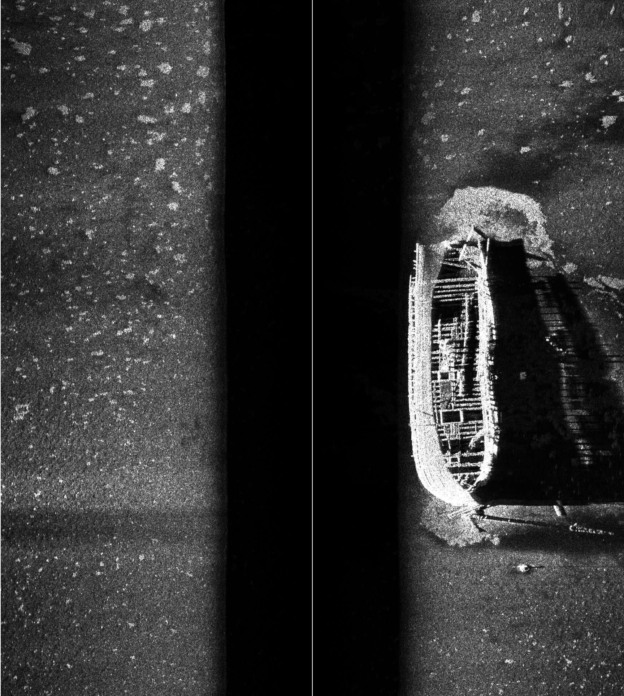

<figure>

  

  <figcaption>Sonar image of the E.B. Allen shipwreck from the AI4Shipwrecks dataset. The E.B. Allen was a two-masted schooner that sank in 1871. </figcaption>
</figure>

A [dataset of shipwreck sonar scans](https://umfieldrobotics.github.io/ai4shipwrecks/) collected by University of Michigan and Michigan Technological University researchers in Alpena, Michigan, has been [selected](https://www.nsf.gov/news/nsf-expanding-national-ai-infrastructure-new-data-systems) as one of ten datasets added to the [National Artificial Intelligence Research Resource (NAIRR) Pilot](https://nairrpilot.org/). 

The NAIRR Pilot is a national effort started by the National Science Foundation (NSF) in 2024 to connect researchers and educators to computational and training resources needed to advance AI research. The [datasets](https://nairrpilot.org/pilotresources), which cover a wide array of topics such as preterm birth research to air turbulence, will help organizations to develop AI skills and train an AI-literate workforce.

“I’m excited that the inclusion of our AI4Shipwrecks open-source dataset extends its use from an ocean exploration research tool to a training tool, and now can be more easily accessed to help train others in artificial intelligence,” Katie Skinner, assistant professor of robotics, said.

The inclusion of AI4Shipwrecks in NAIRR represents a critical link between data infrastructure and AI model development. High-quality, curated datasets like the shipwreck sonar imagery are essential for training robust AI models that can tackle specific domain challenges, and for teaching those looking to advance the field.

Skinner led the research team that collected the sonar scans using an autonomous underwater vehicle in the [Thunder Bay National Marine Sanctuary](https://thunderbay.noaa.gov/) in Lake Huron [in 2022 and 2023](https://oceanexplorer.noaa.gov/expedition/22shipwreck-detection/). The dataset includes side scan sonar imagery of 28 underwater shipwreck sites. The Thunder Bay National Marine Sanctuary itself contains nearly 100 known shipwreck sites and over 100 undiscovered sites. 

<VideoCenter url="https://www.youtube.com/watch?v=UtNK1Ite8no" caption="The expedition capturing sonar imagery in 2022 in Alpena, Michigan." />

Advaith Sethuraman, Anja Sheppard, and Onur Bagoren of U-M, and Christopher Pinnow, Jamey Anderson, and Timothy Havens of Michigan Technological University are all authors of the associated paper, “[Machine learning for shipwreck segmentation from side scan sonar imagery: Dataset and benchmark](https://journals.sagepub.com/doi/10.1177/02783649241266853).”

In addition, the expedition team included Guy Meadows, Michigan Technological University senior research scientist and director of marine engineering technology at the Great Lakes Research Center and Corina Barbalata, an assistant professor of mechanical and industrial engineering at Louisiana State University.

The NSF plans to embed many of the datasets deeper into the NAIRR Pilot, which also offers access to advanced computing, software, platforms, and collaborations, such as the AI Alliance’s open-source tools and models.

The AI4Shipwrecks dataset was supported by the NOAA Ocean Exploration program under Award \#NA21OAR0110196.