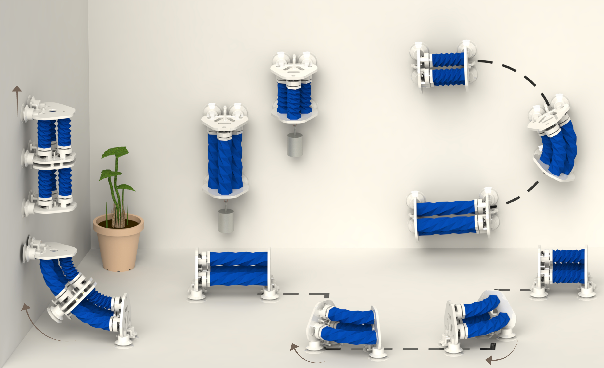

<VideoCenter url="https://youtu.be/P4WSZMJ6Knw" />

Researchers at the University of Michigan and Shanghai Jiao Tong University have developed a soft robot that can crawl along a flat path and climb up vertical surfaces using its unique origami structure. The robot can move with an accuracy typically seen only in rigid robots.

The SPARC robot, short for “Soft, Proprioceptive, Agile Robot for 3D Climbing”, gets around by using three pneumatic actuators based on Kresling origami patterns. These geometric structures, like a twisted accordion, fold predictably under vacuum pressure. Because of this predictability, the team uses the natural twisting motion to accurately determine the robot's body shape without external sensors.

"Most soft robots operate without feedback control, making precise robot control impossible," said Xiaonan Huang, assistant professor at the University of Michigan. 

"By measuring how much our actuators twist as they contract, we can calculate the robot's exact configuration in real-time."

The close to half-pound robot achieved high accuracy when moving, deviating only 0.5% on horizontal surfaces and 3% on vertical walls while carrying a payload over twice its weight. 

“In the past, soft climbing robots typically see trajectory errors that exceed 10% and can’t carry significant loads while climbing,” said Huang.

The team discovered that the amount of twist correlates directly with contraction distance.

"The relationship between contraction and twisting is consistent and predictable," said Jiaqi Wang, co-first author of the associated paper and PhD student at the University of Michigan.

"Through testing this relationship, we achieved sub-millimeter accuracy in length estimation."

<figure>
  

  <figcaption>This illustration shows SPARC moving around, transitioning from horizontal to vertical surfaces, and carrying a payload up a wall using origami-inspired pneumatic actuators. Credit: Paper authors.</figcaption>
</figure>

The researchers successfully put SPARC through four courses: curves and sharp-angled paths on the ground, and straight and curved paths on walls. The team also connected two SPARC robots together, which were able to perform the same ground-to-wall transition as a single robot. This modular design allows for different configurations depending on the task at hand.

To climb, the robot uses silicone suction cups, with a dual-cup design per foot to prevent distortion during vacuum attachment.

"Our next goal is autonomous operation without external power or motion capture equipment," said Huang. 

"In addition to multiple robots working together, the modular design also allows us to integrate different sensor packages and computing units depending on the application."

The paper, "[SPARC: A Soft, Proprioceptive, Agile Robot for 3D Climbing and Exploration with Precise Trajectory Following](https://advanced.onlinelibrary.wiley.com/doi/10.1002/advs.202510382)," is published in Advanced Science. 

Additional authors include co-first author Weicheng Huang, Hongjian Zhang, Qichen Wu, Qihong Hu, Hao Wang, and Genliang Chen from Shanghai Jiao Tong University.

Design files and fabrication details are [available on GitHub](https://github.com/UMich-HDRLab/SPARC).