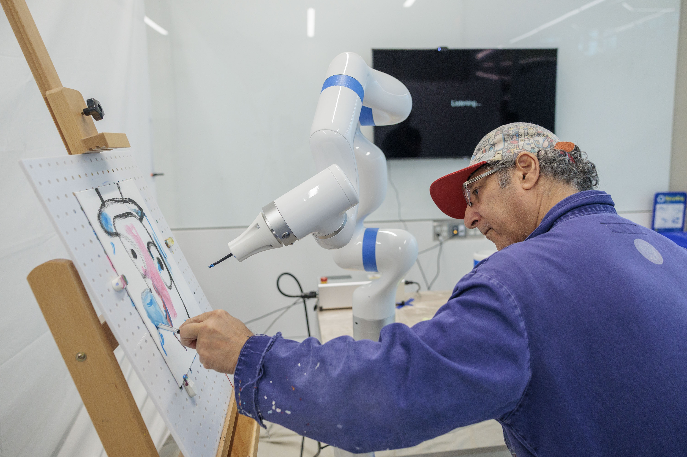
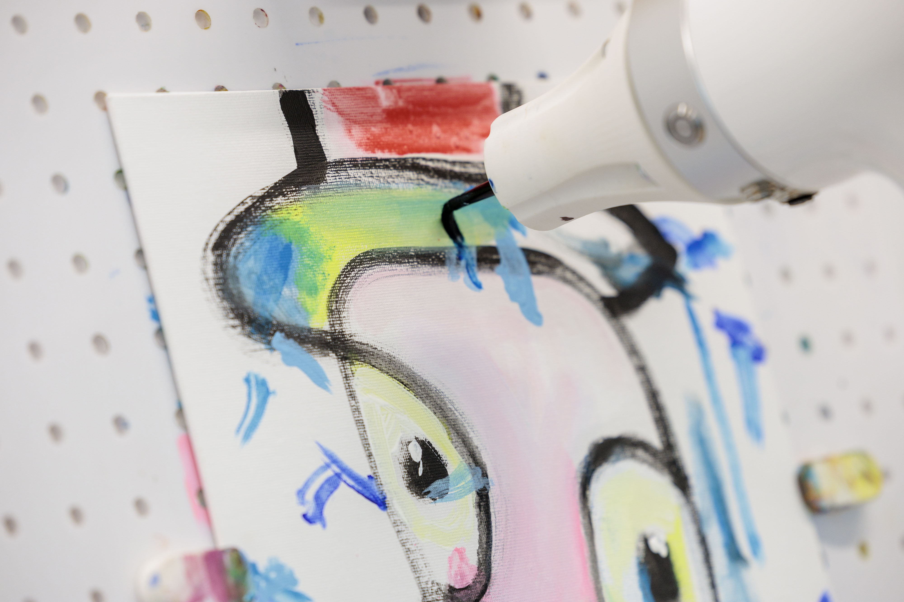
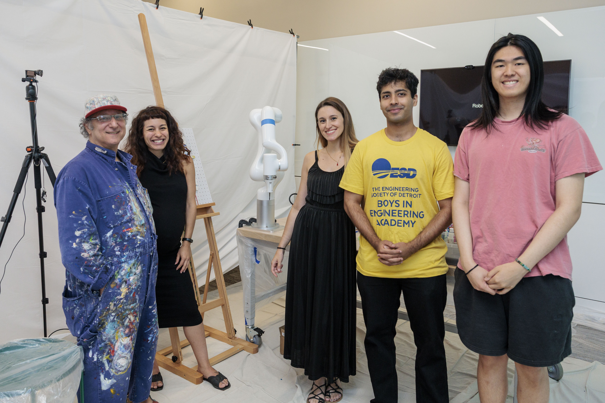

“I would compare it to drawing outside and the wind blowing, like drawing a tree and the leaves moving,” said one artist.

<figure>

  

  <figcaption>Artist Adnan Charara paints with the robot arm programmed to collaborate on artwork. Credit: Jacob Hamilton, MLive.com.</figcaption>
</figure>

Generative artificial intelligence in art is criticized as removing the human emotion and meaning from artwork. Placing the AI in a robot alongside an artist, however, enables new explorations of applying machine intelligence to a physical canvas, one with actual brush strokes and paint instead of pixels, and perhaps with results that have a more than human touch.

To investigate how artists might work collaboratively with a robot, University of Michigan researchers paired eight abstract artists with one another as well as a robot arm over three weeks. They produced several paintings, and their feedback reveals what it’s like to co-create with a robot.

“Research has focused on what robots can contribute to art, but little is known about how artists experience creating with them,” said [Patrícia Alves-Oliveira](/people/faculty/patricia-alves-oliveira/), assistant professor of robotics and principal investigator.

“We explored the artists’ reflections on the nature of the interaction, the creative flow, and how they perceived the robot’s ability to engage socially and contribute artistically to the paintings. This elevates the artists’ experience when looking at human–robot collaboration in the arts.”

The painting robot was controlled by the artist using only two voice commands: start or pause. Given the start command, the robot would begin painting from a set of pre-generated stroke sequences in order to maintain consistency across artist trials. These stroke sequences were built from the Kaggle Abstract Art Gallery dataset paired with a large language model’s generated captions of that dataset, then further prompted with a specific style.

For this study, the art styles were inspired by Bruno Munari, an Italian designer, and Wassily Kandinsky, a Russian-French artist. Munari’s work with geometric shapes of triangle, circle, and square influenced the robot’s approach to forms, and Kandinsky’s theory that paired these shapes with specific colors influenced the color choice among reds, blues, and yellows.

<figure>

  

  <figcaption>The robot applies brush strokes to a painting it works on with an abstract artist. Credit: Jacob Hamilton, MLive.com.</figcaption>
</figure>

In the three sessions that artists had with the robot, the robot was programmed with the strokes derived from each one of the shape and color styles. In the three sessions that the artists had with one another, on the other hand, artists were only prompted to create abstract art.

When working with another human, artists described the sessions as socially rich, intimate, and they acted with mutual respect and adaptation. In collaboration with the robot, however, artists felt they had greater control over the process without the social pressure and need of negotiation with another human.

When working with the robot, artists expressed a desire for a wide range of robot autonomy, with some preferring to retain clear control with no back-and-forth dialogue, and others wanting more input from the system to interrupt their routine, challenge artistic habits, and contemplate what it would be like to have full conversations with the robot.

Artists also compared the robot’s efforts to a child painting, especially with its simple brush stroke capabilities: “It reminded me when I was painting with my daughters when they were very, very young age,” said one participant. They also described working with the robot as fun and playful.

<figure>

  

  <figcaption>The research team, with artist Adnan Charara, from left to right: Patrícia Alves-Oliveira, Francesca Cocchella, Nilay Roy Choudhury, and Eric Chen. Credit: Jacob Hamilton, MLive.com.</figcaption>
</figure>

“Artists were not merely passive users of the robotic system: they actively constructed meaning around the robot’s actions, incorporated its gestures into their practice, and imagined future enhancements that would allow for more expressive interactions,” said Francesca Cocchella, a visiting researcher from the Italian Institute of Technology.

“The insights from our research can meaningfully inform future implementations of robotics in art.”

The associated paper, “[Artists’ Views on Robotics Involvement in Painting Productions: A Longitudinal Investigation of Human–Robot Artistic Collaboration in Abstract Painting](https://ieeexplore.ieee.org/document/11568501),” was published recently in IEEE Robotics & Automation Magazine. Additional authors include Nilay Roy Choudhury and Eric Chen.

This work is funded by DARPA Young Faculty Award (D24AP00323-00).
