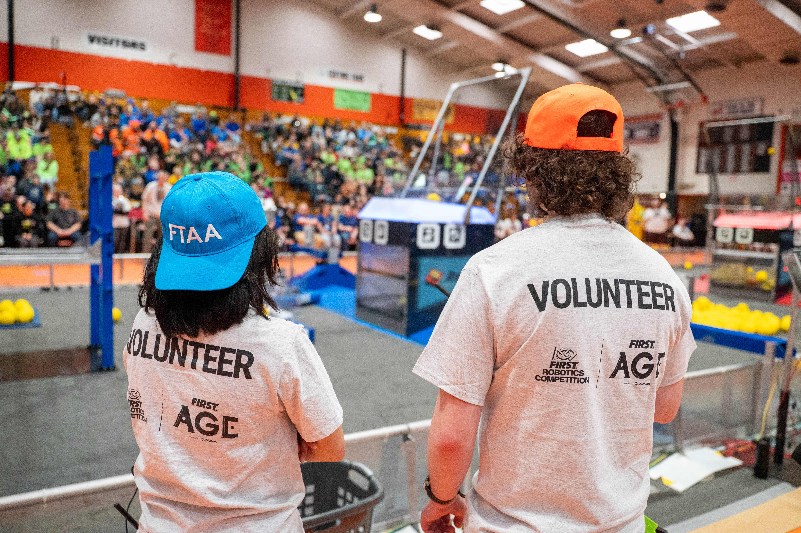
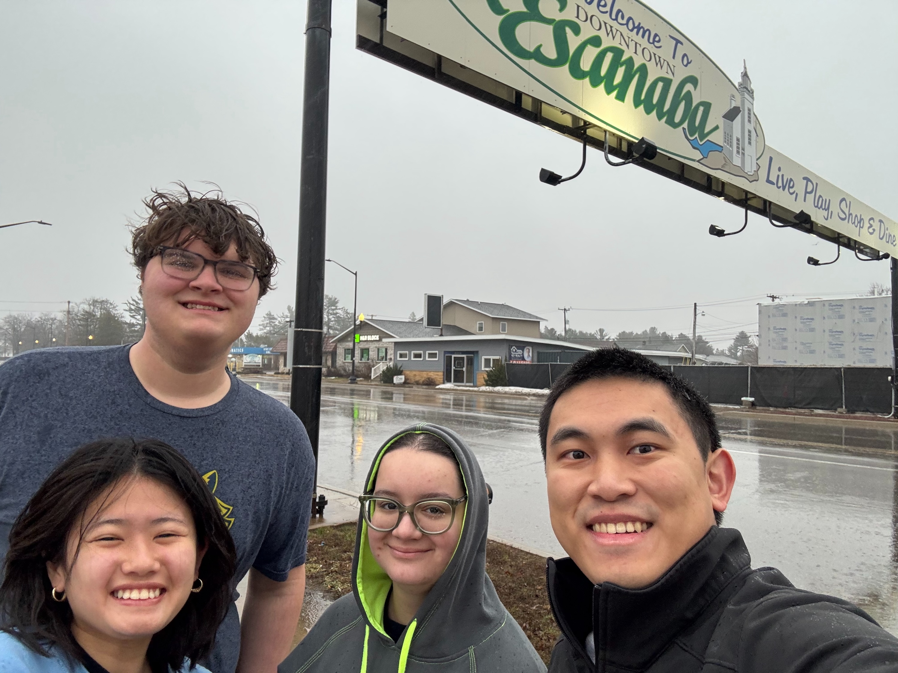
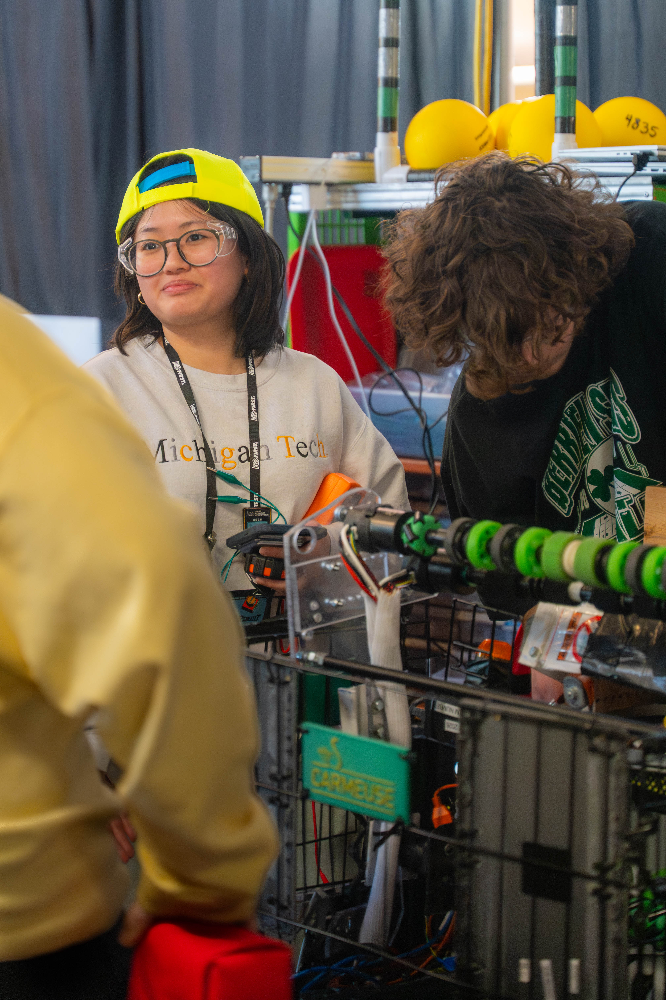

<figure>

  

  <figcaption>Athena Lieu and a volunteer from Michigan Technological University at a FIRST Robotics Competition in Escanaba, Michigan.</figcaption>

</figure>

No state has more high school students spending months designing, building, and competing in FIRST Robotics Competitions than Michigan. In fact, Michigan has more than double the teams of California, New York, or Texas: 531.

Even so, access varies sharply across the state. A team in Southeast Michigan can find three competitions in a 20-mile radius, while a team in the Upper Peninsula only has two all season.

This kind of gap in access across the state is what the FIRST Alumni and Mentors Network at Michigan (FAMNM) is trying to close. FAMNM members are former FIRST participants now studying at the University of Michigan. They traverse the state to volunteer and give back to the community that inspired them.

This past season, FAMNM performed over 1,500 hours of service, covering 5,000 miles across 23 events and crossing paths with 97% of all Michigan teams, according to the group's president, Brandon McDonald, an undergraduate robotics student. They wrangled volunteers to travel across Michigan to places like Escanaba, Sault Ste. Marie, Mt. Pleasant, Muskegon, Berrien Springs, and Marysville, and even a trip to Cleveland, Ohio.

<figure>

  

  <figcaption>FIRST Alumni and Mentors Network at Michigan members traveled to Escanaba, Michigan to volunteer at a FIRST Robotics Competition in April, 2026.</figcaption>

</figure>

These mitten-spanning trips have given the organization a unique view of how teams operate across the state, including what obstacles a team from Metro Detroit faces versus one in the U.P.

"Upper Peninsula teams lost a week or more of school because they got three feet of snow," said Jiawei Chen, a Robotics PhD student.

"The teams have no access to the robot during snow days. When you have a six-week build season and you lose a week, that puts you at a disadvantage no matter how talented your team is."

Mentor backgrounds also differ greatly. "Around Ann Arbor, you have a lot of mentors from Toyota or the University of Michigan," Chen said.

"Up north, you tend to see more people from blue-collar jobs, and they bring a different set of expertise. As with any event, it can take flexibility to work with teams because even when we're there in a technical role, we're not there to fix the robot for them. We're there to see what they're good at and fill in some of the gaps if they ask for help."

Athena Lieu, a U-M undergraduate who transferred from Michigan Tech, has a deeper connection to teams up north. Even from Ann Arbor, where she plans to study nuclear engineering, Lieu still mentors a team in Houghton. "Unfortunately, many of the teams do not have many resources and they depend on volunteers," said Lieu. "Despite this, they still show lots of dedication and it is inspiring to see what they can do."

<figure class="w-full md:float-right md:ml-8 md:mb-4 md:max-w-50 lg:max-w-75">

  

  <figcaption>Athena Lieu inspects a robot at the Escanaba competition.</figcaption>

</figure>

In Escanaba, the robotics competition required the same roles as any other competition in the state, only with fewer local volunteers available to fill them. Field supervisors and FIRST technical advisors worked behind the glass keeping the event safe, judges interviewed teams to help decide event awards, and control system advisors (CSA) jumped into team pits to troubleshoot electronics and hardware issues.

"As a CSA, you really get a great opportunity to work with a team and say, 'I see you have a problem, let me help you fix it.' We're going to get you as competitive as you can be and get you on the field as quickly as possible," McDonald said.

Chen offered his approach to judging. "It's not just about whether you got a robot on the field that can perform. You want to know what their process is, how they think as engineers. That's really what FIRST is all about: it's not just building good robots, it's whether you're fostering a community of future engineers."

"Some teams find innovative ways to build their robot," said Lieu.

One Escanaba team showcased a unique approach to save on materials cost. They recycled shells of old Chromebooks as structural elements for robots, and shared this method with other teams.

While the Chromebook idea was unique to Escanaba, collaboration among teams is present at any FIRST competition.

"One of the big principles of FIRST is gracious professionalism," McDonald said. "Even though you're directly competing, it's, 'Hey, my radio isn't working, can I borrow yours for a match?' I want to compete against you at your best."

An outreach grant from the Robotics Department enabled FAMNM's trip to Escanaba, and allowed the group to double the number of events in which they participated from the previous year.

In addition to on-the-road volunteering and mentoring teams, FAMNM also works to expand opportunities beyond the season. The group ran an off-season event last August at Skyline High School that drew 32 teams, including squads from New York, Ohio, and Petoskey, with U-M faculty serving as judges.

For FAMNM members, volunteering perpetuates a virtuous cycle.

"Being enthusiastic about robots is what led me into FIRST as a high schooler," said Chen. "Being involved with FIRST is what inspired me to pursue robotics as a PhD student. And being a Robotics PhD student is what inspired me to go back to my roots and volunteer again."

"The U.P. team will always have my heart and support," said Lieu. "They remind me why I continue to serve FIRST."
