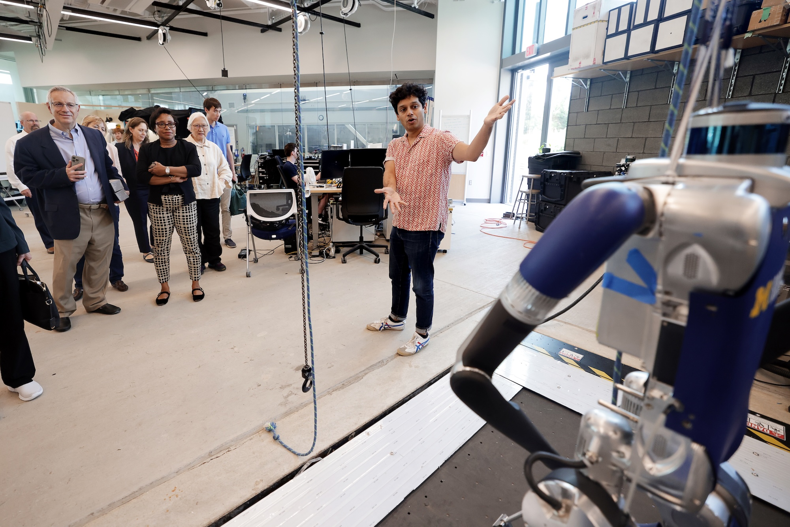

<figure>
  

  <figcaption>Ram Vasudevan presents legged robotics research to the President's Council of Advisors on Science and Technology in 2024. Photo: Brenda Ahearn/University of Michigan, College of Engineering, Communications and Marketing.</figcaption>
</figure>

The University of Michigan Robotics Department is proud not only of the accomplishments of its students, but also of the faculty and staff who work hard to build a department that fosters the next generation of robotics and roboticists.

The Departmental Faculty Award recognizes faculty for high-impact accomplishments benefiting the Department and the College of Engineering. This year, the department congratulates [Ram Vasudevan](/people/faculty/ram-vasudevan/) on receiving the Robotics Departmental Faculty Award.

The College recognizes staff through the Staff Excellence Awards Program, which selects a handful of honorees from across the College who exemplify sustained excellence in service.

For the fourth straight year, a Robotics Department-affiliated staff member earned this distinction. The department congratulates Samantha Price on receiving the Staff Excellence Award.

Ram Vasudevan, Associate Chair of Graduate Studies, is a Professor of Robotics and Mechanical Engineering and the director of the [ROAHM](https://www.roahmlab.com) (Robotics and Optimization for the Analysis of Human Motion) Lab. His research spans the optimization and control of nonlinear and hybrid dynamical systems, the locomotion of legged robots, shared-control active safety systems, and techniques to automate diagnostic and rehabilitative tasks. Beyond his research contributions, Vasudevan has been instrumental in shaping the department's graduate experience, guiding the structure of the Master's and Ph.D. programs and supporting students as the graduate community has grown.

[Samantha Price](/people/staff/samantha-price/), the department's HR Generalist, is described as "the heart of the department." Price's human resources work touches on all aspects of the department, especially as it has added students, faculty, and staff in its transition from an institute to a full-fledged department. Price helped grow the staff from six to nearly 20, helped faculty navigate the new department, onboarded 13 new faculty hires, and supported the growing graduate and undergraduate programs by managing teaching personnel.

Price was honored at this year's Staff Excellence Awards Program on June 3, 2026, along with other [College of Engineering recipients](https://rpm.engin.umich.edu/past-recipients-of-awards/).
