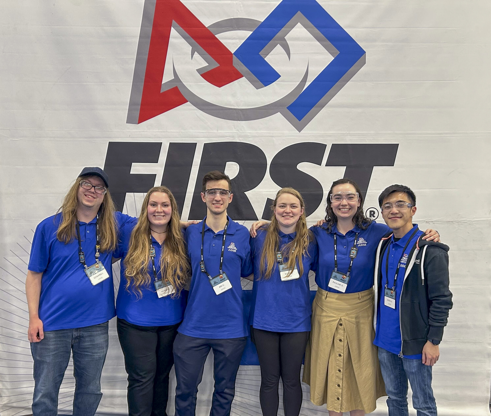

We instill within Michigan roboticists a [set of values](/about/values/) to help guide their work. One of these values is *enthusiastic for outreach*.

Our outreach efforts serve three purposes: building for and inspiring the next generation of roboticists, informing policies that benefit society, and fostering public understanding of where robotics is as a field right now.

Enthusiastic outreach takes many forms, from assembling underwater robots with high schoolers in a test tank, to judging FIRST Robotics competitions, to organizing department events that strengthen our own community.

There are a select set of our community members who have put forth notable effort toward outreach since the academic year began in the fall. These students earn the Robotics Outreach Ambassador title, which is in recognition of their outreach work that is in addition to a student's typical research and coursework.

More than half of this year's ambassadors are returning from previous cohorts, reflecting their sustained commitment. This cohort, smaller than previous year's, was also able to meet the service hour qualification in a shorter timeframe as we adjust the program to align with the academic year.

We congratulate the following Robotics Outreach Ambassadors of 2026:

<ColumnList columns={2}>

- Anandi Arora
- Onur Bagoren
- Jessica Carlson
- Jiawei Chen
- Cale Colony
- Zariq George
- Seth Isaacson
- Ted Ivanac
- Yazid Marzuk Kalluparamban
- Tianxiang Lin
- Nandan Natesan
- Abigail Rafter
- Anja Sheppard
- Anuhea Tao
- Katharine Walters

</ColumnList>

These individuals contributed to a vast number of activities and events across a wide range of communities, including:

- Running underwater robotics workshops at the [Michigan Engineering Zone (MEZ)](https://mez.engin.umich.edu/), where high school students assembled robot kits, received a lecture on underwater robotics, and piloted three different robots in the FRB tank

- Organizing and volunteering at STEMulation 2026, providing STEM and college preparatory experiences for minority and underserved 10th and 11th grade high school students in collaboration with the [Graduate Society of Black Engineers and Scientists (GSBES)](https://gsbes.org/), the [National Society of Black Engineers (NSBE)](https://www.nsbe.org/), and partner schools across metro Detroit

- Serving as judges at [FIRST Robotics Competition](https://www.firstinspires.org/robotics/frc) district and regional events in Saline and Belleville, interviewing student teams and helping award decisions

- Mentoring a [FIRST Robotics Competition](https://www.firstinspires.org/robotics/frc) team for a full season, meeting weekly in the fall, multiple times per week through winter and spring, and traveling to weekend-long competitions

- Running robot demonstrations at the Wines Elementary Science Builder Fair and the Campus Day Info Fair, using platforms such as MBot and Amazon Astro, and engaging students one-on-one with open-ended questions and encouragement

- Leading activities at Pleasant Lake Elementary as part of the [BLUElab Woven Wind](http://bluelab.engin.umich.edu/woven-wind.html) activity days

- Hosting a Cub Scouts day in partnership with [Tau Beta Pi, Michigan Iota Gamma chapter](https://www.tbp.org/home.cfm), introducing younger students to engineering

- Coordinating prospective student outreach around PhD Visit Day, including open lab hours, hardware demonstrations, and conversations about the [Women in Robotics and Engineering (WiRE+)](https://sites.google.com/umich.edu/wireplus) community

- Planning and running events throughout the year for [WiRE+](https://sites.google.com/umich.edu/wireplus), supporting community for women in robotics and engineering

- Organizing the [Robotics Graduate Student Council](https://robotics.umich.edu/academics/student-services/robotics-graduate-student-council/) (RGSC) colloquium series, including the Candidacy Qualifying Exam practice talks in the fall, and assisting with the RGSC Welcome BBQ for incoming students

- Coordinating funding and logistics for Cocoa and Canvases, an end-of-semester destress event for the department

These outstanding students have demonstrated exceptional commitment to serving Michigan Robotics and communities worldwide. Though their documented service distinguishes them as ambassadors, we also celebrate the many other students whose unrecorded contributions continue to make meaningful differences in our community.
