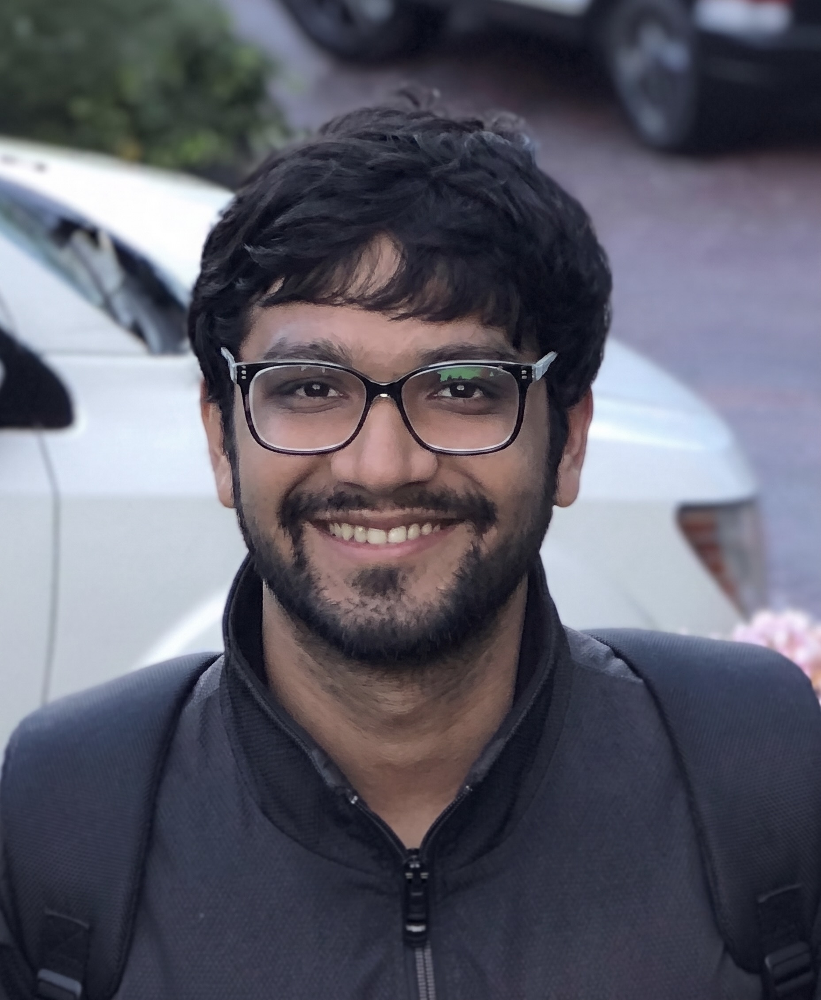

The University of Michigan Robotics Department is adding two faculty members over the next year to support growing academic programs and research focus areas.

Justin Opfermann and Ankit Goyal join a faculty of 35 roboticists who are dedicated to creating the next generation of roboticists and robotics for the benefit of society.

## Justin Opfermann

<figure class="w-full md:float-right md:-mt-14 md:ml-8 md:mb-4 md:max-w-50 lg:max-w-75">
  
</figure>

Joining in the winter of 2027, Justin Opfermann will work on medical robotics, machine learning, and mechanical design to develop innovative technologies for autonomous and minimally invasive surgery.

Opfermann comes to U-M following a postdoctoral appointment at Johns Hopkins University, where he earned his PhD in mechanical engineering. Drawing on his background in biomedical engineering and medical device commercialization, he emphasizes translational research that bridges engineering innovation with clinical needs, moving new technologies from the laboratory toward clinical implementation and commercialization.

## Ankit Goyal

<figure class="w-full md:float-right md:-mt-14 md:ml-8 md:mb-4 md:max-w-50 lg:max-w-75">

  

</figure>

Joining in the fall of 2027, Ankit Goyal will work on robot learning, dexterous manipulation, robot foundation models, and 3D perception.

Goyal is currently Head of AI at Proception, where he leads the effort to build the dexterous manipulation learning stack. Before that, he spent four years as a Senior Research Scientist at NVIDIA's Robotics Research Lab. He received his PhD in computer science from Princeton University, advised by Professor Jia Deng.
