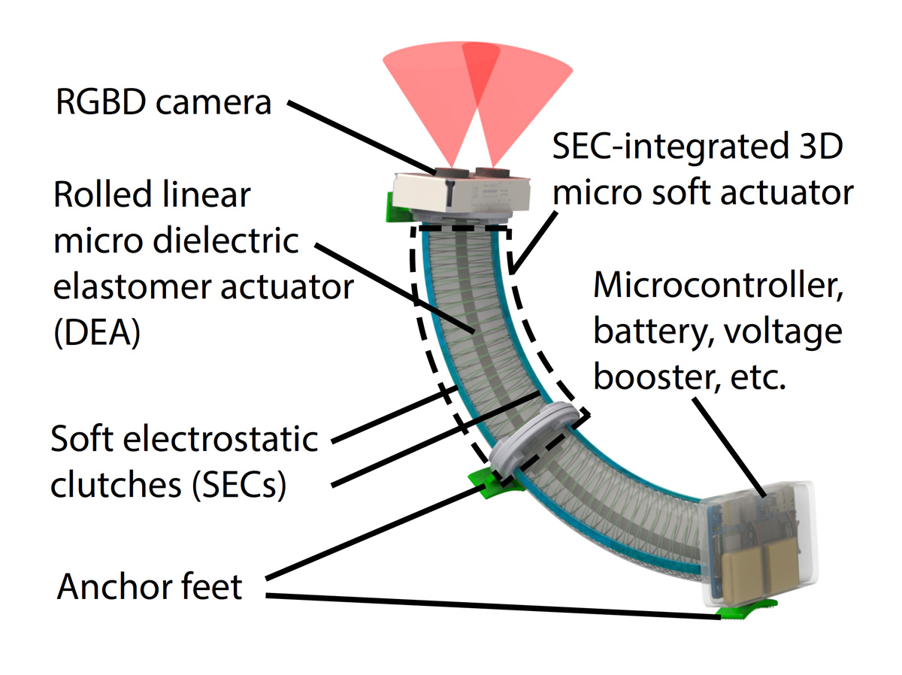
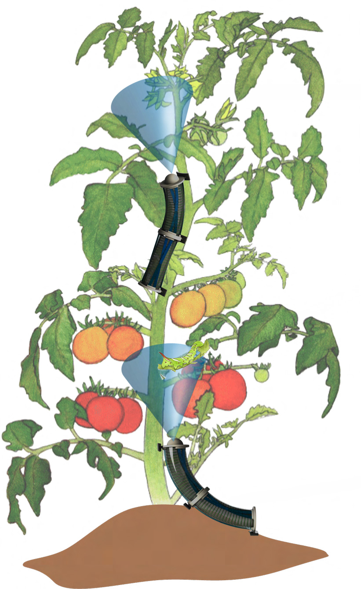

<figure>

  

  <figcaption>Shoppers at the Ann Arbor Farmers Market purchasing organic vegetables. Photo: Marcin Szczepanski.</figcaption>

</figure>

Beyond hordes of ladybugs, organic farmers of the future may have a very inorganic tool to combat pests before they cause crop damage: soft microrobots that can climb around plant stems to identify potential infestations.

The National Institute of Food and Agriculture, under the United States Department of Agriculture, awarded Michigan researchers $1M to develop the breakthroughs needed for the five-centimeter pest-detection robots.

"These will be the first low-cost, autonomous soft microrobots that can climb plants and detect pests with onboard resources," said [Xiaonan Sean Huang](/people/faculty/xiaonan-sean-huang/), assistant professor of robotics and principal investigator on the project. "Being the first, they will need to do a few things that current microrobots cannot."

"We will develop the robot with a full range of motion in three dimensions to walk and climb up stems, sensing to determine where it is and where to go, and the ability to tune its stiffness in order to twist around leaves and maintain its balance," Huang added.

<figure>

  

  <figcaption>Schematic of the robot featuring onboard depth camera, specialized soft actuators allowing for movement in any direction, feet for climbing, and onboard power and electronics. Courtesy Xiaonan Huang.</figcaption>

</figure>

In addition to those features, the team will develop a new algorithm to enable the robots to inspect the plants thoroughly, using a small depth-sensing camera, while burning as little energy as possible. This work will be led by co-principal investigator [Dmitry Berenson](/people/faculty/dmitry-berenson/), associate professor of robotics.

Once a pest is detected, the robot would notify the farmer through a radio signal, allowing for a proper and precise response.
<figure class="w-full md:float-right md:ml-8 md:mb-4 md:max-w-50 lg:max-w-75">

  

  <figcaption>An illustration of soft microrobots climbing a tomato plant to inspect for pests. Courtesy Xiaonan Huang.</figcaption>

</figure>
The key component to allow the soft robot to move in any direction is a new actuator design using "soft electrostatic clutches." Placed along a soft muscle-like actuator, these clutches can stiffen or slacken on demand, turning what would otherwise be simple stretching and shrinking into controlled bending in any direction. These clutches are relatively cheap, incredibly lightweight, and consume trace amounts of power, among their many benefits to this application.

And to walk, climb, and go upside down if needed, the robots will use an array of techniques including dry adhesion, similar to gecko feet, electrostatic adhesion, similar to the static cling from a clothes dryer, and active grasping of the robot feet.

The team believes high-value crops with climbable stems include tomatoes, peppers, melon, squash, and cucumber, and the robots could detect hornworms, beetles, and aphids in a few hours after deployment.

Currently, no untethered soft microrobots are capable of navigating 3D space or climbing vertical surfaces, as both require bulky power and electronics.

The project, titled "A Bug’s-Eye View: Climbing Soft MicroRobots for Pest Detection," is supported by USDA NIFA Grant 2026-67021-46039.
