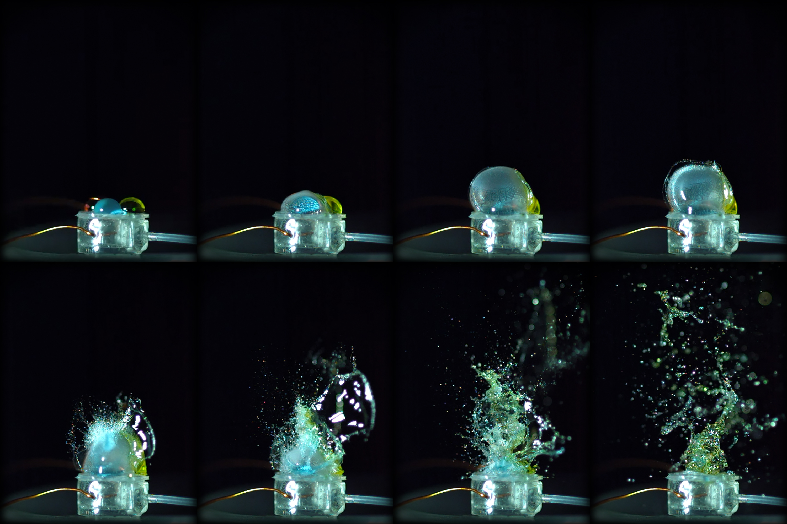
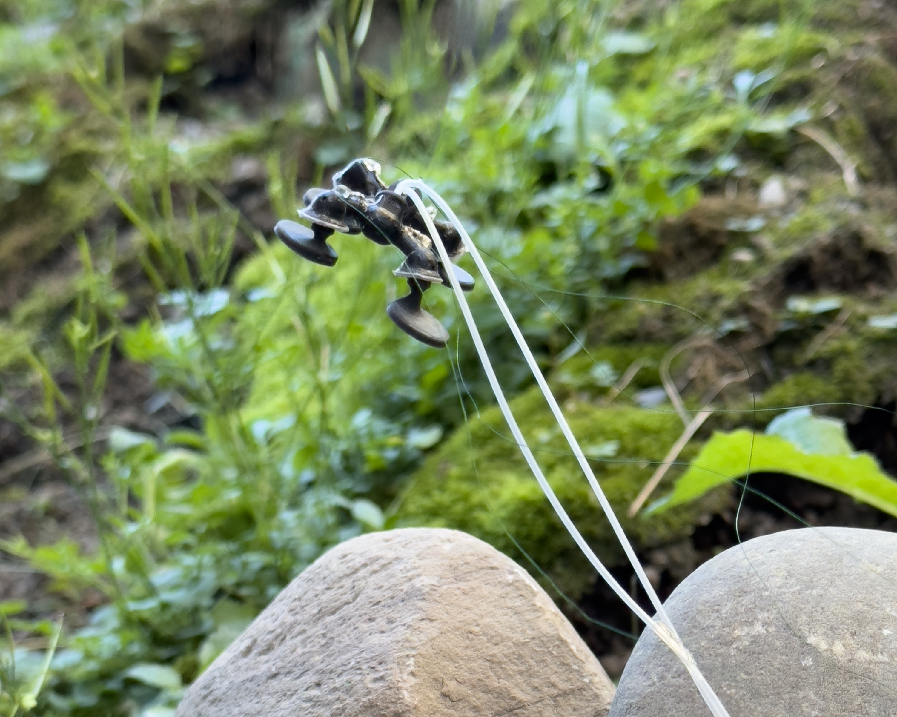

<figure>

  

  <figcaption>"Spark of Color."</figcaption>

</figure>

In three milliseconds, three drops of water exploded upward while a high-speed camera captured thousands of frames. A set of those photos, titled "Spark of Color," was exhibited at the [2026 IEEE International Conference on Soft Robotics](https://www.robosoft2026.org/program/art-gallery/) (RoboSoft) in Kanazawa, Japan, where it won both the Audience Choice award in the Photography category and the Image of Distinction award.

What does dancing water have to do with soft robotics?

"We make these tiny soft actuators that are kind of like drums," said [Cameron Aubin](/people/faculty/cameron-aubin/), assistant professor of robotics.

<VideoCenter url="https://youtu.be/hgGQVzyc_qw" caption="A tiny controlled explosion inflates the soft membrane of a microcombustion actuator, sending colorful, carefully arranged water droplets skyward. The actuator measures just 8 millimeters in diameter, while the high-speed sequence captures only 3 milliseconds of motion." />

"The combustion actuators have a rigid body about one centimeter wide and a soft translucent membrane on top," said Manvi Saxena, a robotics graduate student. "We introduce a mixture of methane and oxygen into them and then use a small spark to ignite everything."

"Typically, we use them like pistons on our insect-scale robots to allow them to walk and jump around," said Aubin, whose work revolves around discovering new materials, designs, and power systems for robots, often inspired by nature. In [one such robot](https://www.science.org/doi/10.1126/science.adg5067), four of these actuators act as feet turned to the ground and allow it to crawl along or leap high over obstacles.

<figure>

  

  <figcaption>A quadruped insect-scale robot jumps over terrain with soft actuators. Credit: Cameron Aubin.</figcaption>

</figure>

To create the award-winning artwork, the team flipped an actuator face up. After mixing water with food coloring, an idea from graduate student Jason Brown, they placed three drops on top of the drum-like surface. Saxena filled the fuel chamber with an optimized mix of methane and oxygen, then sparked the combustion while graduate student Yihao Geng captured the event at 23,000 frames per second. While the setup took hours, the captured moment was a fraction of a second.

The team, including department communicator Dan Newman, selected the eight best photos from the resulting video, showcasing the actuator's unique speed and power alongside the water droplets' surface tension. The selected photos also showcase the maize and blue colors, an homage to the University of Michigan.

The artwork will appear on the cover of the upcoming [Soft Robotics (SoRo) journal](https://journals.sagepub.com/home/srb).
