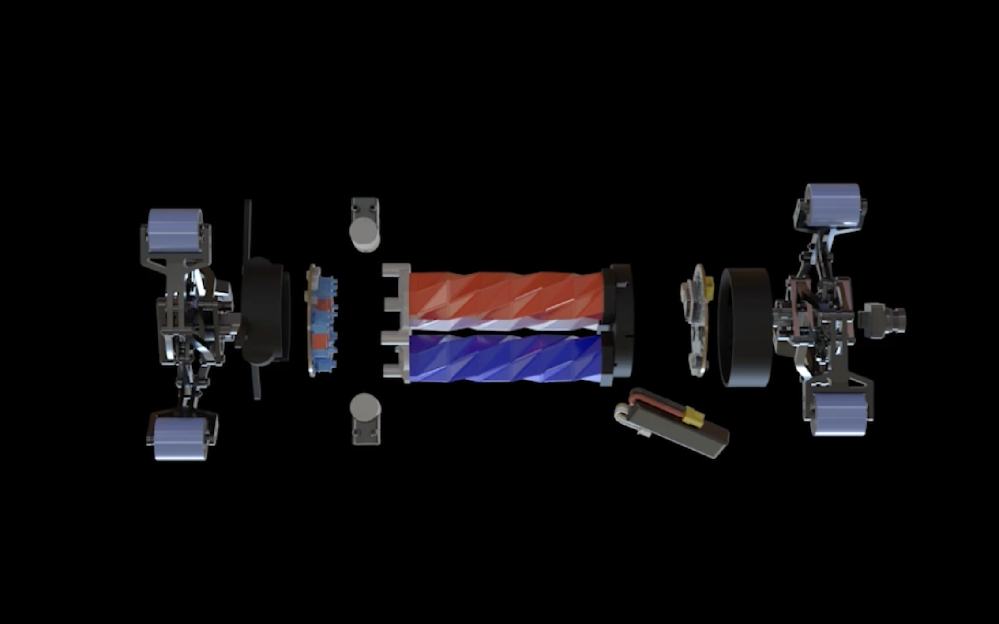

<VideoCenter url="https://youtube.com/shorts/KEYbjBzB0t4" />

University of Michigan researchers developed an untethered robot that can crawl along horizontal or vertical pipelines and maneuver around sharp turns and tight junctions to detect potential defects before they lead to costly failures.

To ensure pipelines operate safely and reliably, whether carrying critical water or fuel supplies, regular inspections are necessary to find and fix abnormalities that might lead to leaks or spills. Large and straight pipelines enable inspection with more traditional robots, such as those with wheels. Smaller and more complex pipelines, however, introduce varying pipe diameters and 90-degree turns.

To help investigate these more complex pipelines, the SPPIRO (soft, power-autonomous, proprioceptive in-pipe) robot features onboard power, sensing, and control, and can move along in pipelines sized 140mm to 200mm by folding and unfolding with Kresling origami actuators.

“The robot moves a bit like an earthworm,” said [Xiaonan Huang](/people/faculty/xiaonan-sean-huang/), assistant professor of robotics. “Two anchors on either end of the robot can hold it in place, while the central pneumatic section can lengthen or shorten to push or pull it in any direction within a pipe.”

“The design of the anchors allows the robot to move easily across pipes of varying diameters, as well as make turns, where a more rigid robot might be unable to maneuver,” said Zexiong Chen, a graduate student studying robotics and first author on the related paper.

“It’s also the first demonstration of an untethered soft robot steering through a T-joint,” Chen added.

<figure>

  <figcaption>A mockup exploded view of the SPPIRO robot, showing its anchors at each end and the central Kresling origami section that lengthens and shortens to move it like an earthworm. Credit: Paper authors.</figcaption>
</figure>

The robot can achieve vertical speeds of 9.5 millimeters per second, and horizontal speeds of 6.5 millimeters per second. These figures are at least five times the speed of other untethered soft in-pipe robots.

Because SPPIRO is fully untethered, it has to perceive its surroundings on its own. The team turned the Kresling actuators into sensors as well as muscles. As each actuator contracts, it twists by a predictable amount, and onboard encoders measure that twist to determine how long each actuator has become. From those measurements the robot reconstructs both its own body shape and the geometry of the surrounding pipe in real time to effectively map the pipeline as it travels through it.

Liquid-metal-based soft capacitive sensors embedded in the wheels tell the robot when its feet are firmly in contact with the wall, which is essential for reliable anchoring in opaque pipes where the operator cannot see inside. Paired with an onboard camera, the robot can record imagery and flag potential defects in fully enclosed pipes.

Before a robot like SPPIRO could be deployed, the researchers note several challenges that remain. The soft central body can sag in horizontal pipes, and the pipe-mapping model can lose accuracy when the robot is in frequent contact with the wall. The team is exploring stiffer torso designs and adding a second body segment to provide an additional anchor point, reduce drag, and steady the robot’s motion.

The paper, “[SPPIRO: a Soft, Power-autonomous, Proprioceptive In-pipe Robot for adaptive inspection in complex pipeline environments](https://www.nature.com/articles/s44182-026-00093-0),” was published in npj Robotics. Additional authors include Xinqi Zhang and Jiaqi Wang.

This research was supported in part by the National Science Foundation under Award IIS-2332554.
