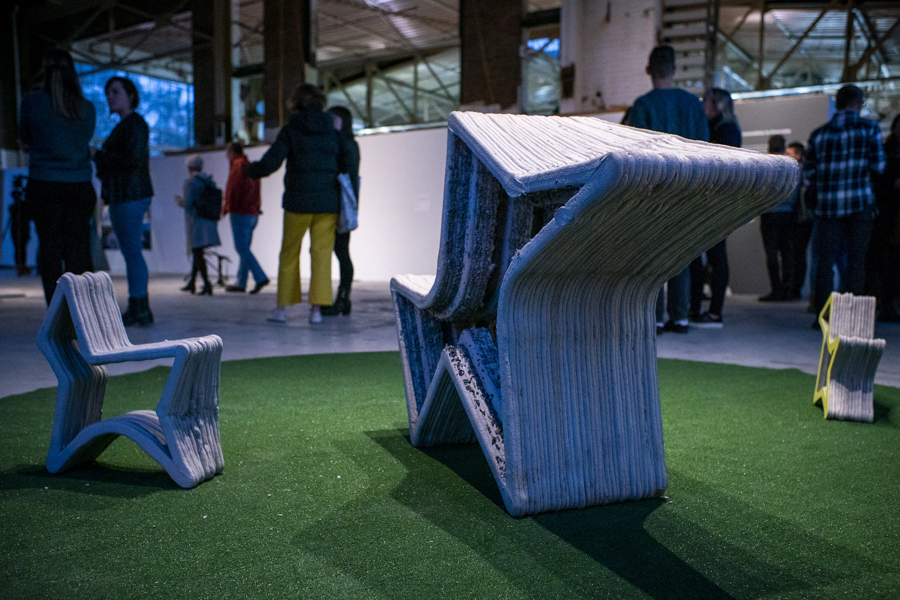

<figure>
  
  

  <figcaption>3D printed concrete art on display during the 2019 Innovation in Concrete Symposium organized by the University of Michigan Taubman College of Architecture + Urban Planning and the Civil and Environmental Engineering department. Photo: Robert Coelius.</figcaption>

</figure>

Concrete is ubiquitous in built environments, but working with it requires attention to the details of timing, forms, supports, and weather. Three-dimensional printing also requires attention to details of timing, form, and supports, or the plastic may end up in much the same spaghetti shape as before. And to 3D print concrete, the potential issues from both realms require solutions before the technology can be useful in a traditional construction setting.

To research this, [Yulun Tian](/people/faculty/yulun-tian/), assistant professor of robotics, is starting a new project backed by an award from the Bold Challenges Initiative from the University of Michigan's [Research Launchpad](https://research.umich.edu/michigan-research-launchpad/). The project, "AI-Enabled Digital Twins for Closed-Loop Robotic 3D Concrete Printing," is a collaboration with Jiaqi Li, assistant professor of civil and environmental engineering.

According to the researchers, additive manufacturing in construction could reduce labor costs by 50 to 80 percent and represent a nearly $5 billion market by 2030. But, concrete mixes can go awry, weather and temperature can cause issues, and 3D printing itself requires a high standard of accuracy to create strong structures that meet blueprints.

"The project will develop a real-time digital twin that continuously reconstructs and predicts the evolving state of the 3D concrete printing process," said Tian.

"Multimodal data from onboard sensors and mobile monitoring robots will be fused using 3D vision, spatial mapping, and physics-informed machine learning to create a predictive model of material deposition and structural evolution. This predictive representation enables early detection of geometric drift, material inconsistencies, and potential structural defects."

The team hopes their work will enable 3D concrete printing to adapt to differences in concrete mix formulations, and any detected or predicted deviations from the plan.

[Bold Challenges awarded the team](https://record.umich.edu/articles/bold-challenges-awards-researchers-exploring-manufacturing-and-ai-future-of-food/) $42,500 in seed funding, alongside funding for teams exploring how to cut the time and cost required to certify new shipbuilding components and exploring solutions to food insecurity. The program, led by the Office of the Vice President for Research, aims to connect researchers with the resources they need to increase their competitiveness for external funding.
